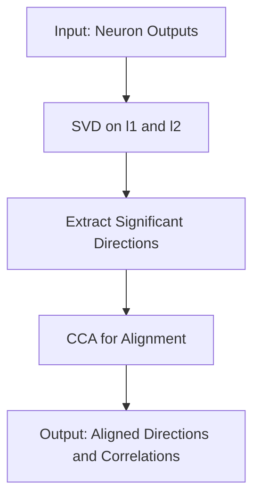

- **SVCCA Overview**: Singular Vector Canonical Correlation Analysis (SVCCA) combines Singular Value Decomposition (SVD) and Canonical Correlation Analysis (CCA) to analyze deep learning representations.
  
- **Key Contributions**:
  - **Dimensionality vs. Neurons**: The intrinsic dimensionality of a layer's representation is often much lower than the number of neurons, allowing for model compression.
  - **Learning Dynamics**: Networks converge to final representations from the bottom up, suggesting a method called Freeze Training to improve efficiency.
  - **Speed Optimization**: A method based on the discrete Fourier transform accelerates SVCCA application to convolutional networks.

- **SVCCA Methodology**:
  - **Input**: Two sets of neuron outputs (layers) \( l_1 \) and \( l_2 \).
  - **Step 1**: Perform SVD on both layers to extract significant directions, retaining those that explain 99% of variance.
  - **Step 2**: Apply CCA to align the subspaces and compute correlation coefficients \( \rho_i \) for the aligned directions.

- **Mathematical Representation**:
  - Neuron output vector for neuron \( i \) in layer \( l \):
    \[
    z^l_i = (z^l_i(x_1), \ldots, z^l_i(x_m))
    \]
  - Subspace spanned by layer \( l \):
    \[
    \text{span}(z^l_1, \ldots, z^l_m)
    \]

- **Distributed Representations**: SVCCA identifies that important directions in representations are often distributed across multiple neurons rather than being axis-aligned.

- **Experimental Findings**:
  - **Accuracy with SVCCA Directions**: Using a small number of SVCCA directions can achieve similar accuracy to using all neurons in a layer.
  - **Comparison with Random Neurons**: SVCCA directions outperform random neuron selections in terms of required dimensions for maintaining accuracy.

- **Applications**:
  - **Model Compression**: Insights from SVCCA can inform strategies for reducing model size without sacrificing performance.
  - **Training Regimes**: Suggests new training methods that can save computation and reduce overfitting.

- **Scaling SVCCA**:
  - **Same Layer Comparisons**: Concatenate outputs from different timesteps or initializations.
  - **Different Layer Comparisons**: Flatten convolutional layers to compare across different architectures or depths.

- **Visual Representation**: 

- **Future Directions**: Further exploration of the nature of representations and their implications for neural network design and interpretability.