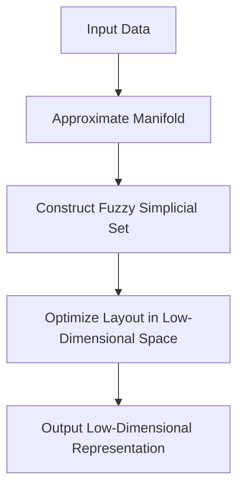

- **UMAP Overview**: UMAP (Uniform Manifold Approximation and Projection) is a dimension reduction technique based on Riemannian geometry and algebraic topology, designed for scalability and effective visualization of high-dimensional data.

- **Key Advantages**:
  - Competitive with t-SNE in visualization quality.
  - Preserves more global structure than t-SNE.
  - No computational restrictions on embedding dimension.
  - Scalable to larger datasets compared to t-SNE.

- **Theoretical Foundations**:
  - Built on the work of Belkin and Niyogi regarding Laplacian eigenmaps.
  - Utilizes concepts from topology and category theory.
  - Constructs fuzzy simplicial sets to represent data topology.

- **Algorithm Steps**:
  1. **Manifold Approximation**: Assumes data is uniformly distributed on a manifold, approximating geodesic distances.
  2. **Fuzzy Simplicial Set Construction**: Converts local metric spaces into a global fuzzy simplicial set representation.
  3. **Optimization**: Minimizes cross-entropy between topological representations of high-dimensional and low-dimensional data.

- **Mathematical Notation**:
  - Let \( M \) be the manifold and \( g \) the Riemannian metric.
  - For point \( p \in M \), \( g_p \) is an inner product on the tangent space \( T_p M \).
  - Geodesic distance approximation: \( d_M(p, q) \approx \frac{1}{r} d_{\mathbb{R}^n}(p, q) \) for points \( p, q \) in a ball \( B \).

- **Fuzzy Set Definition**:
  - A fuzzy set is defined by a carrier set \( A \) and a membership function \( \mu: A \to [0, 1] \).
  - Membership strength \( \mu(x) \) indicates the degree of belonging of \( x \) to set \( A \).

- **Implementation Details**:
  - Discusses hyper-parameters and their effects on the algorithm's performance.
  - Provides practical results and scaling experiments demonstrating UMAP's effectiveness.

- **Comparative Analysis**:
  - Appendix C contrasts UMAP with t-SNE and LargeVis, highlighting differences in approach and performance.

- **Limitations**:
  - Discusses scenarios where UMAP may not be the best choice for dimension reduction.

- **Future Directions**:
  - Potential extensions include semi-supervised learning, metric learning, and heterogeneous data embedding.

