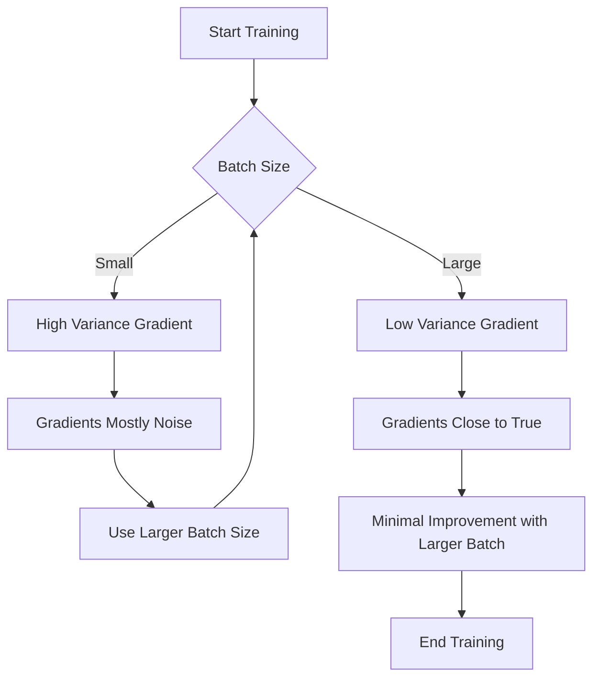

- **Gradient Noise Scale (GNS)**: A key statistic predicting the largest efficient batch size across various domains.
- **Batch Size and Efficiency**: Larger batch sizes can lead to almost linear speed-ups in training until reaching the noise scale, after which benefits diminish.
- **Noise Scale Definition**: The noise scale is defined as the point where the variance of the gradient equals the signal of the gradient, indicating balanced noise and signal.
- **Empirical Validation**: The paper empirically tests the GNS across multiple tasks (e.g., ImageNet, CIFAR-10, Dota 2) and shows it accurately predicts the largest usable batch size.
- **Training Dynamics**: The noise scale increases as the model's performance improves, suggesting a relationship between model accuracy and gradient noise.
- **Compute-Time Tradeoff**: The tradeoff curve between compute efficiency and time efficiency is influenced by the noise scale, with a turning point where further increases in batch size yield minimal benefits.
- **Dynamic Batch Size Tuning**: Adjusting batch size dynamically according to the noise scale during training can lead to efficiency gains.
- **Mathematical Formulation**:
  - Estimated gradient: \( G_{\text{est}}(\theta) = \frac{1}{B} \sum_{i=1}^{B} \nabla_{\theta} L_{x_i}(\theta) \)
  - Variance of the estimated gradient: \( \text{cov}(G_{\text{est}}(\theta)) = \frac{1}{B} \Sigma(\theta) \)
  - Optimal step size: \( \eta_{\text{opt}}(B) = \arg\min E[L(\theta - G_{\text{est}})] \)
  - Improvement in loss: \( \Delta L_{\text{opt}}(B) = \Delta L_{\text{max}} \left(1 + \frac{B_{\text{noise}}}{B}\right) \)
- **Illustrative Figures**: 
  - Figure 1: Tradeoff curve between compute and time efficiency.
  - Figure 2: Comparison of optimization trajectories with varying batch sizes and noise levels.
  
