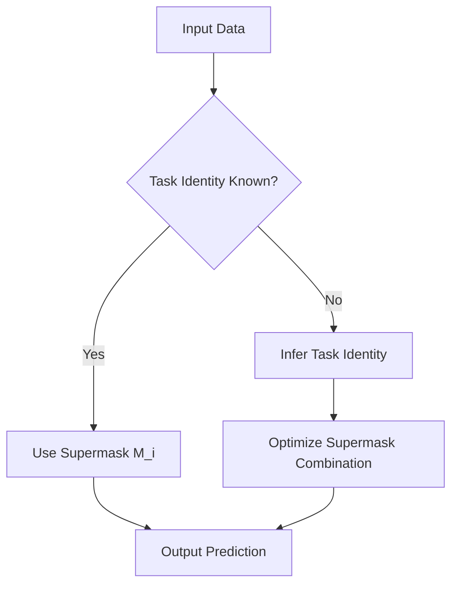

- **SupSup Model Overview**: Capable of learning thousands of tasks sequentially without catastrophic forgetting by using a fixed, randomly initialized base network and task-specific subnetworks (supermasks).

- **Core Concepts**:
  - **Supermasks**: Binary masks that select connections in a neural network, allowing for the creation of subnetworks that perform well on specific tasks.
  - **Task Identity Inference**: When task identity is unknown, SupSup infers it by optimizing a convex combination of supermasks to minimize output entropy.

- **Key Contributions**:
  1. **New Taxonomy for Continual Learning**: Introduces a three-letter taxonomy (e.g., GG, GN, NNs) to classify continual learning scenarios based on task identity availability during training and inference.
  2. **Performance in GG Scenario**: SupSup outperforms baselines on SplitImageNet with fewer storage and time costs when task identity is provided during training and testing.
  3. **Performance in GN Scenario**: Achieves high accuracy on 2500 permutations of MNIST without forgetting when task identity is provided during training but not during testing.
  4. **NNs Scenario**: Can infer task boundaries and allocate new supermasks when task identity is not provided at all.
  5. **Hopfield Network Extension**: Stores supermasks as attractors in a fixed-size Hopfield network, allowing for efficient memory usage.
  6. **Superfluous Neurons**: Adding extra neurons improves task inference accuracy.

- **Mathematical Formulation**:
  - **Output Calculation**: For a given task \( i \), the output is computed as:
    \[
    p = f(x, W \odot M_i)
    \]
    where \( \odot \) denotes the elementwise product.

- **Entropy Minimization for Task Inference**: The task identity inference problem is framed as:
  \[
  \min_{\alpha_i} H(p) \quad \text{subject to} \quad \sum \alpha_i = 1
  \]
  where \( H(p) \) is the entropy of the output distribution.

- **Performance Metrics**: SupSup achieves an average top-1 accuracy of 88.68% with 100.98M bytes in the GG scenario, outperforming other methods like BatchE.

- **Diagram of SupSup Process** (if needed):

- **Continual Learning Scenarios**:
  - **GG**: Task identity given during training and inference.
  - **GN**: Task identity given during training, not during inference.
  - **GNu**: Task identity given during training, unshared labels.
  - **NNs**: No task identity given during training or inference.

- **Related Work**: SupSup builds on methods like Elastic Weight Consolidation (EWC) and Progressive Neural Networks (PNN), but uniquely operates across all four scenarios of continual learning.