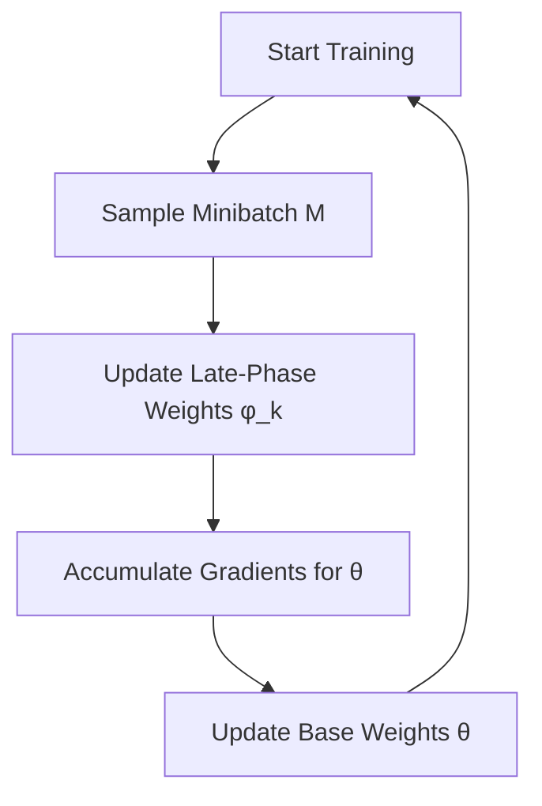

- **Stochastic Gradient Descent (SGD)**: Primary method for training neural networks; generalizes well across various problems.
  
- **Late-Phase Weights**: Introduced to improve generalization by ensembling a subset of weights during late training stages. 

- **Weight Interaction Function**: Defined as \( w = h(\theta, \phi) \), where \( \theta \) are base weights and \( \phi \) are late-phase weights.

- **Late-Phase Weight Initialization**: Initialized from a reference base weight \( \phi_0 \) with perturbations:
  \[
  \phi_k = \phi_0 + \sigma_0 Z(\phi_0)_k
  \]
  where \( Z(\phi_0) = \sqrt{D(l) / \phi_0} \).

- **Late-Phase Weight Averaging**: At test time, a single model is obtained by averaging late-phase weights:
  \[
  y(x) = f_w(x), \quad w \equiv h(\theta, \frac{1}{K} \sum_{k=1}^{K} \phi_k)
  \]

- **Stochastic Learning Algorithm**: Simultaneously optimizes \( K \) parameterizations \( W = \{w_k | w_k = h(\theta, \phi_k)\}_{k=1}^{K} \) during late training stages.

- **Gradient Accumulation**: Accumulates gradients over shared base weights \( \theta \) while updating late-phase weights \( \phi_k \).

- **Batch Normalization Layers**: Used as late-phase weights due to their expressive power; includes learnable parameters \( \gamma \) (scale) and \( \beta \) (shift).

- **Rank-1 Matrix Weights**: Late-phase weights defined as \( \phi(l) = u(l)v(l)^T \) and interact multiplicatively with base weights.

- **Hypernetworks**: Generalizes late-phase weight models; generates parameters of a target neural network based on a weight embedding.

- **Late-Phase Classification Layers**: Weights of the last linear layer are used as late-phase weights, typically having fewer parameters.

- **Theoretical Analysis**: Explores a noisy quadratic problem to provide insights into late-phase learning dynamics.

- **Empirical Results**: Show improved generalization on benchmarks like CIFAR-10/100, ImageNet, and enwik8 with late-phase weight models.

- **Algorithm Summary**: 
  - **Input**: Base weights \( \theta \), late-phase weights \( \Phi \), dataset \( D \), gradient scale \( \gamma_\theta \), loss \( L \).
  - **Output**: Updated weights after training iterations.

