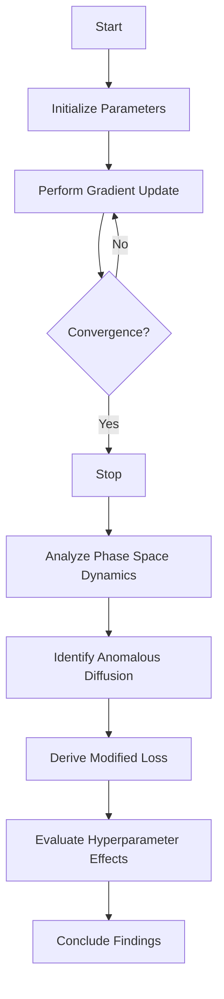

- **Anomalous Diffusion in SGD**: Networks trained with SGD exhibit anomalous diffusion, where the distance traveled in parameter space grows as a power law in the number of gradient updates, characterized by a nontrivial exponent \( c \) such that \( \| \Delta k \|^2 \propto k^c \).

- **Continuous-Time Model**: The dynamics of SGD can be modeled as an underdamped Langevin equation, accounting for finite learning rates and stochastic gradient noise. The equation is given by:
  \[
  d \begin{bmatrix} \theta \\ v \end{bmatrix} = \begin{bmatrix} v \\ -2\eta(1+\beta)(g(\theta) + \lambda \theta + (1 - \beta)v) \end{bmatrix} dt + \begin{bmatrix} 0 & 0 \\ 0 & 2\sqrt{\eta S(1+\beta)} \Sigma(\theta) \end{bmatrix} dW_t
  \]

- **Modified Loss Function**: The key driver of the dynamics is a modified loss function that regularizes velocity, leading to non-zero probability currents in phase space, breaking detailed balance.

- **Hessian Matrix Influence**: The interaction between hyperparameters, gradient noise structure, and the Hessian matrix at the end of training is crucial for understanding the limiting dynamics.

- **Ornstein-Uhlenbeck Process**: In the context of linear regression, the dynamics of SGD can be shown to correspond to an Ornstein-Uhlenbeck process, with the SDE given by:
  \[
  d \begin{bmatrix} \theta_t \\ v_t \end{bmatrix} = -A \left( \begin{bmatrix} \theta_t \\ v_t \end{bmatrix} - \begin{bmatrix} \mu \\ 0 \end{bmatrix} \right) dt + 2\kappa^{-1} D(\theta) dW_t
  \]
  where \( A \) and \( D(\theta) \) are drift and diffusion matrices.

- **Covariance Structure Assumption**: The covariance of the gradient noise is assumed to be spatially independent and proportional to the Hessian of the least squares loss, \( \Sigma(\theta) = \sigma^2 H \).

- **Empirical Validation**: The limiting dynamics of a ResNet-18 model trained on ImageNet exhibit the predicted qualitative characteristics, indicating isotropic behavior in the limiting trajectory regardless of the original training loss anisotropy.

- **Hyperparameter Effects**: The influence of learning rate, batch size, and momentum coefficient on the instantaneous speed of the network and the anomalous diffusion exponent is quantitatively derived and matches empirical observations.

- **Power Law Relationship**: The squared norm of global displacement remains monotonically growing, indicating continuous divergence from the initial parameter state, even after performance convergence.

- **Fokker-Planck Equation**: The stationary distribution derived from the Fokker-Planck equation is a Gibbs distribution on the modified loss, which is essential for understanding the phase space dynamics.

- **Diagrammatic Representation** (if needed):
