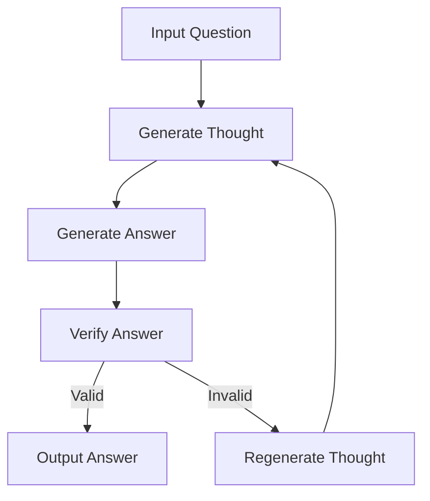

- **Language Model Cascades**: A framework for combining multiple language models (LMs) to enhance reasoning capabilities through probabilistic programming.
  
- **Probabilistic Programming Languages (PPL)**: Extend traditional programming to handle complex joint distributions with string-valued random variables, allowing for dynamic structures and control flow.

- **Key Techniques**:
  - **Scratchpads**: Allow LMs to generate intermediate thoughts before arriving at an answer.
  - **Chain of Thought**: Encourages step-by-step reasoning by conditioning answers on previous thoughts and questions.
  - **Verifiers**: Separate models that assess the validity of reasoning paths taken by LMs.
  - **Selection-Inference**: Splits reasoning into selection of relevant facts and inference based on those facts.

- **Mathematical Representation**:
  - Few-shot prompting: \( p(A|Q, D) \) where \( D \) is a set of question-answer pairs.
  - Incorporation of auxiliary thought variable: 
    \[
    p(A, T | Q) = p(A|T, Q)p(T | Q)
    \]
  - Joint distribution for cascades:
    \[
    p(A|Q) = T p(A|Q, T)p(T |Q)
    \]

- **Cascades Implementation**: Implemented as trace-based PPLs in Python, supporting recursion and complex control flows.

- **Self-Taught Reasoner (STaR)**: A method for fine-tuning LMs using a semi-supervised approach, leveraging both fully and partially observed datasets.

- **Experimental Application**: Demonstrated effectiveness in tasks like "Twenty Questions", modeling interactions as Markov chains to optimize question-asking strategies.

- **Tool-Use Integration**: LMs can interact with external systems (e.g., calculators, web browsers) to enhance problem-solving capabilities.

- **Verification Process**: 
  - Training set includes verification labels: \( D = {(Q_m, T_m, A_m, V_m)} \) where \( V_m \in \{0, 1\} \).
  - N-step reasoning with verifiers:
    \[
    p(A|Q, V_{1:N} = 1) \propto T_{1:N} p(A, T_{1:N}, V_{1:N} = 1 | Q)
    \]

- **Flowchart for Cascades** (if needed):

- **References**: Key papers and methodologies referenced throughout the text, including foundational works on LMs and PPLs.