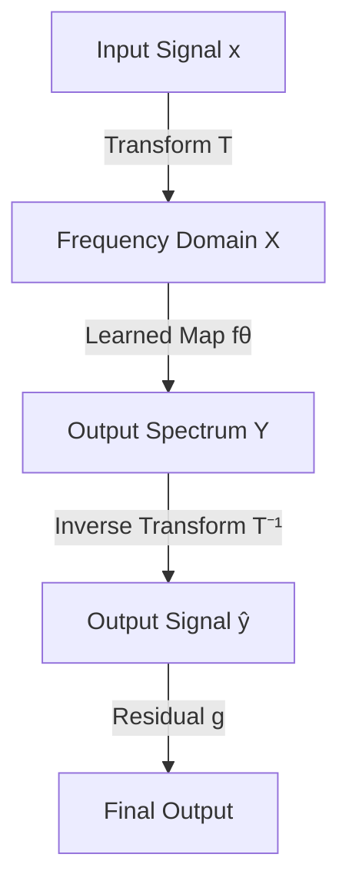

- **Title**: Efficient Operator Learning in Frequency Domain
- **Key Concept**: Frequency-domain models (FDMs) leverage the structure in the frequency domain for efficient learning of long-range correlations in signals.
- **Transform Once (T1)**: Introduces a single transform approach to reduce computational overhead associated with traditional FDMs that require both forward and inverse transforms.
- **Weight Initialization**: Variance preserving weight initialization scheme is derived to enhance learning efficiency in frequency domain.
- **Speedup**: T1 achieves speedups of 3x to 10x compared to traditional FDMs, increasing with data resolution and model size.
- **Predictive Accuracy**: T1 models show over 20% reduction in predictive error across various tasks while requiring significantly less computation time (5 hours vs. 32 hours for large-scale experiments).
- **Learning Objective**: The learning objective for T1 is defined as:
  \[
  \min_{\theta} E_{x,y} \| T(y) - \hat{Y} \|^2 \quad \text{subject to} \quad \hat{Y} = f_{\theta} \cdot T(x)
  \]
- **Parseval-Plancherel Identity**: Establishes the equivalence of minimizing errors in the frequency domain and the original signal space, allowing for efficient learning in the k-space.
- **Transform Selection**: The normalized Discrete Cosine Transform (DCT-II) is chosen for T1 due to its effective representation of smooth signals and superior energy compaction properties compared to DFT.
- **Reduced-Order T1 Model**: Operates on a reduced k-space \( D_m \) with \( m < N \) elements, allowing for smaller neural networks and efficient learning.
- **Mode Selection**: Optimal mode selection for reduced-order T1 is based on retaining the top-m modes with the highest magnitude to minimize irreducible loss.
- **Irreducible Loss Bound**: The overall loss \( L_{\theta} \) is defined as:
  \[
  L_{\theta}(X, Y) = J_{\theta}(X, Y) + R_o
  \]
  where \( R_o \) represents the irreducible residual loss due to truncation of predictions.
- **Empirical Observations**: Reduced-order T1 often results in smaller irreducible error compared to non-reduced-order FDMs, indicating better efficiency in learning tasks.

