- **Continuous Convolutional Neural Network (CCNN)**: A general-purpose CNN architecture that processes data of arbitrary resolution, dimensionality, and length without structural changes.
  
- **Continuous Convolutional Kernels**: Key component of CCNN; parameterized by a small kernel network \( \phi_{\text{kernel}} \) that outputs kernel values based on input coordinates, allowing for arbitrary kernel sizes.

- **Decoupling Parameter Count from Kernel Size**: Continuous parameterization allows for efficient construction of large convolutional kernels without increasing the number of parameters.

- **Modeling Long-Range Dependencies**: CCNN can model long-range dependencies in N-dimensional data without input-dependent downsampling or depth values, addressing a major limitation of traditional CNNs.

- **Empirical Performance**: CCNN matches or outperforms state-of-the-art methods across various tasks in 1D (sequential), 2D (visual), and 3D (point-cloud) data.

- **Irregularly Sampled Data Handling**: CCNN can natively process irregularly sampled data, unlike traditional CNNs that are restricted to grid data.

- **Comparison with Existing Architectures**: CCNN scales favorably compared to methods like the Perceiver, which requires mapping inputs to a small latent representation and uses absolute positional encodings.

- **Pointwise Operations**: Operations like pointwise linear layers and nonlinearities are independent of input shape and can be used unchanged in CCNN.

- **Global Operations**: Normalization layers and global pooling can be applied without changes, as they define learnable parameters only along the channel axes.

- **Local Operations**: Traditional local operations (e.g., convolution) are dependent on input resolution and length; CCNN addresses this by using continuous kernels.

- **Initialization of Neural Networks for Kernels**: Proposed initialization method for neural networks used to parameterize convolutional kernels to improve performance.

- **References to Key Works**: 
  - Continuous Kernel Convolutions (CKConvs) as foundational for CCNN.
  - Implicit neural representations (SIRENs) for modeling complex long-range dependencies.

- **Algorithmic Flow**: 

```mermaid
flowchart TD
    A[Input Data] --> B[Kernel Network φ_kernel]
    B --> C[Continuous Convolutional Kernels]
    C --> D[CCNN Architecture]
    D --> E[Output Predictions]
```

- **Key Contributions**: 
  - Development of a unified CNN architecture.
  - Empirical validation across multiple data types.
  - Addressing the limitations of existing CNN architectures in handling diverse input characteristics.