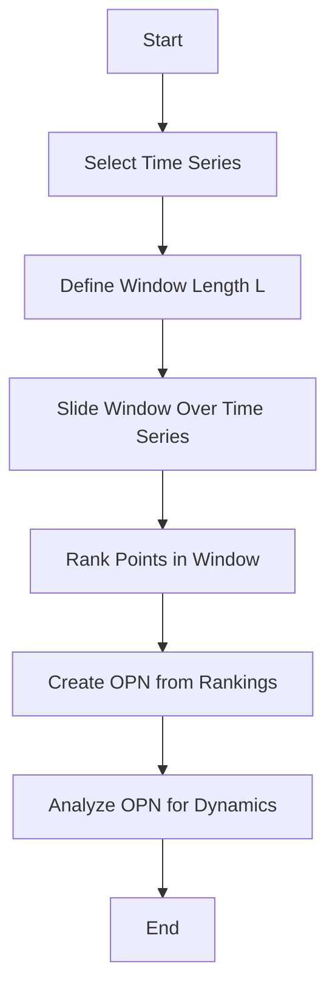

- **First Return Map (FRM)**: A discrete map connecting points of a dynamical system's orbit as it first returns to a Poincaré section. It simplifies the analysis of complex dynamics by projecting continuous systems to lower-dimensional maps.

- **Poincaré Section**: An n-1 dimensional surface transverse to the flow of a dynamical system where orbits intersect. The first return map is constructed from these intersections.

- **Ordinal Partition Networks (OPN)**: A method to generate a network representation of a time series by sliding a window of length \( L \) over the data, capturing the relative order of points within each window.

- **Window Parameters**:
  - **Window Length \( L \)**: Total length of the sliding window.
  - **Number of Points \( m \)**: Number of points in each window.
  - **Time Gap \( \tau \)**: Gap between points in the window, where \( L = (m-1)\tau \).
  - **Non-overlapping Points \( w \)**: Number of non-overlapping points between windows.

- **Ranking Methods**:
  - **Amplitude Ranking**: Ranks points based on their amplitude.
  - **Chronological Index Ranking**: Ranks points based on their time index.

- **Entropy-based Measures**: Used to evaluate and select ordinal sequences that yield "good" first return maps, enhancing the robustness of the reconstruction.

- **Noise Resistance**: The ordinal-based approach is robust against noise, making it suitable for real-world data with significant noise contamination.

- **Application to Chaotic Systems**: The method has been validated on well-known chaotic systems such as Lorenz, Rössler, and Mackey-Glass, demonstrating its effectiveness in reconstructing first return maps.

- **Comparison with Traditional Methods**: Unlike traditional embedding techniques (e.g., Takens' theorem), the ordinal approach does not require full access to the attractor or complex numerical models, simplifying the analysis of chaotic dynamics.

- **Flowchart of OPN Construction**:

- **Key Results**: The method successfully reconstructs first return maps from scalar time series, providing insights into the underlying dynamics without the need for complex modeling.