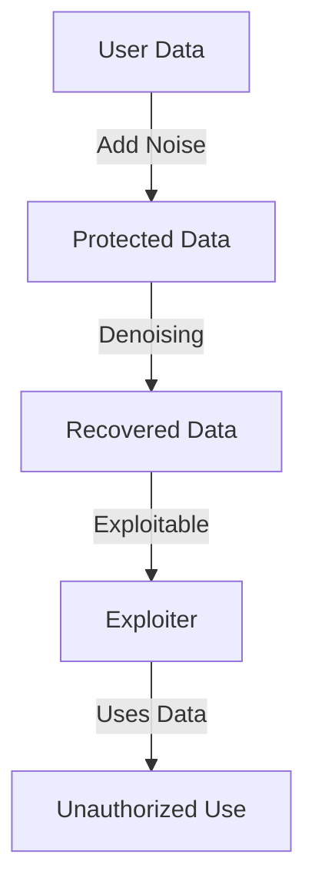

- **Title of Paper**: The Devil's Advocate: Shattering the Illusion of Unexploitable Data using Diffusion Models

- **Main Contribution**: Introduction of AVATAR, a countermeasure against availability attacks that utilizes diffusion models to recover data from data-protecting perturbations.

- **Key Concept**: Availability attacks aim to add imperceptible noise to data to prevent unauthorized exploitation while maintaining data utility.

- **Threat Model**: Exploitation of protected data is feasible through pre-trained density estimators, which can counteract data-protecting perturbations.

- **Denoising Process**: 
  - **Forward Process**: Add Gaussian noise to images.
  - **Reverse Process**: Denoise the noisy images using a diffusion model to recover the original data.

- **Theoretical Result**: The number of diffusion steps required to cancel data-protecting perturbations is directly related to the magnitude of the perturbations' norm.

- **Performance**: AVATAR outperforms adversarial training against various availability attacks across multiple datasets and architectures.

- **Mathematical Notation**:
  - Dataset: \( D = \{(x^{(i)}, y^{(i)})\}_{i=1}^n \)
  - Neural Network Classifier: \( f_\theta: \mathbb{R}^d \to \mathbb{R}^K \)
  - Loss Function: 
    \[
    \text{arg min}_\theta E_{(x,y) \in D} [\ell(f_\theta(x), y)]
    \]
  - Perturbed Data: \( x^{(i)} = x^{(i)} + \delta^{(i)} \) with \( \|\delta\|_p \leq \epsilon \)

- **Related Work**: 
  - Availability attacks vs. traditional poisoning and backdoor attacks.
  - Previous methods for generating availability attacks include auto-encoders, GANs, and optimization-based approaches.

- **Conclusion**: The paper highlights the fragility of unexploitable data and calls for further research into effective data protection methods.

- **Diagram (if needed)**:
