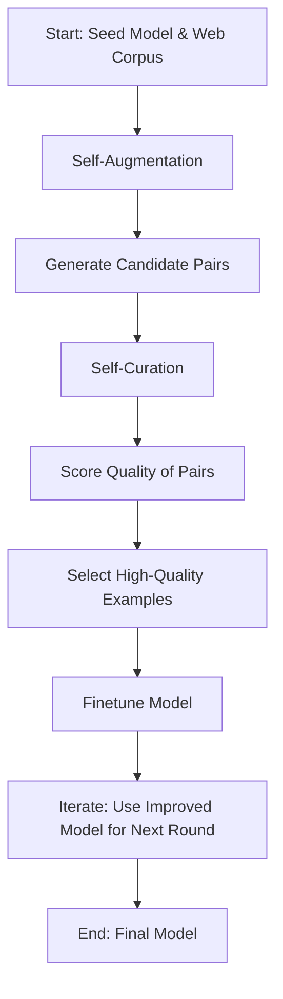

- **Method Overview**: Instruction backtranslation involves two main steps: self-augmentation and self-curation, iteratively improving the model's ability to follow instructions.
  
- **Self-Augmentation**: 
  - Generate instructions for unlabelled data using a backward model \( M_{yx} \) to create candidate pairs \( A = \{(x_i, y_i)\} \).
  - Finetune the base model on seed data to predict instructions from outputs.

- **Self-Curation**: 
  - Use the model \( M_0 \) to score candidate pairs based on quality, selecting those with scores \( a_i \geq k \) for training.
  - Iteratively refine the model \( M_t \) using curated data from previous iterations.

- **Initialization**: 
  - Seed data consists of 3200 human-annotated (instruction, output) pairs.
  - Unlabelled data sourced from a web corpus, preprocessed to extract self-contained segments.

- **Finetuning Details**: 
  - Base model: LLaMa (7B, 33B, 65B parameters).
  - Training hyperparameters: learning rate \( 1e^{-5} \) (decaying to \( 9e^{-6} \)), weight decay \( 0.1 \), batch size \( 32 \) (or \( 8 \) for <3000 examples), dropout \( 0.1 \).

- **Evaluation Metrics**: 
  - Win rate against baselines (e.g., text-davinci-003) using AlpacaEval.
  - Diverse test prompts covering various task categories (writing, coding, etc.).

- **Key Findings**: 
  - High-quality data significantly improves model performance; low-quality data does not contribute positively.
  - The scaling coefficient \( \alpha \) for Humpback is \( 6.95 \), indicating efficient data scaling compared to other models.

- **Baselines for Comparison**: 
  - text-davinci-003: Instruction following model based on GPT-3.
  - LIMA: LLaMA models with 1000 manually selected instruction examples.
  - Guanaco: LLaMA models with 9000 examples from the OpenAssistant dataset.

- **Iterative Process**: 
  - Each iteration improves the model's ability to select high-quality training data, leading to better instruction following capabilities.

- **Data Quality vs. Quantity**: 
  - Emphasizes the importance of high-quality training data over sheer quantity for effective instruction alignment.

- **Diagrammatic Representation** (if needed):
