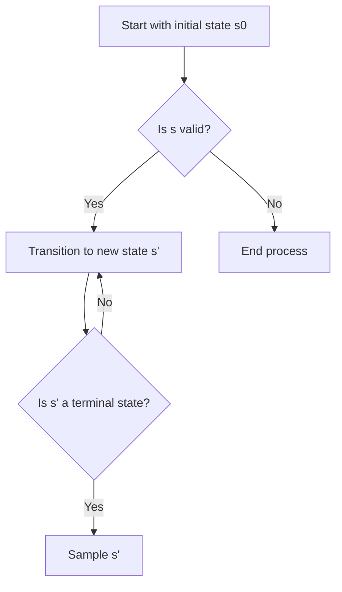

- **Causal Discovery (CD)**: The process of inferring causal relationships from data, particularly when structural knowledge is incomplete.
  
- **Ancestral Graphs (AGs)**: Directed graphs that represent causal relationships, allowing for latent confounding without explicitly modeling unobserved variables. Key properties include:
  - Directed edges (→) indicate causal relationships.
  - Bidirected edges (↔) indicate associations due to latent confounding.

- **Generative Flow Networks (GFlowNets)**: A generative model used to sample from distributions over AGs, designed to avoid mixing time issues of MCMC methods. Key characteristics:
  - Samples are drawn proportionally to a reward function \( R \).
  - Transition probabilities are defined by a forward flow function \( \pi_F \).

- **Bayesian Information Criterion (BIC)**: A score function used to evaluate the goodness-of-fit of models, guiding the sampling of AGs in the proposed method.

- **Importance Sampling**: A technique used to update beliefs over AGs based on expert feedback without retraining the GFlowNets, enhancing the efficiency of the learning process.

- **Iterative Expert Feedback**: The proposed method involves querying experts about relationships between variable pairs to refine causal inferences, optimizing uncertainty reduction through a utility function based on expected cross-entropy.

- **Markov Equivalence Class (MEC)**: A class of AGs that share the same conditional independencies, which CD algorithms aim to reconstruct from observational data.

- **Structural Causal Model (SCM)**: A framework for representing causal relationships, defined by a set of observed variables \( V \), unobserved variables \( U \), and structural equations that describe the relationships among them.

- **Key Contributions**:
  1. Introduction of AGFN, a CD algorithm that incorporates human feedback and probabilistic inference under latent confounding.
  2. Demonstration of effective sampling from distributions over AGs, capturing epistemic uncertainty.
  3. Development of an experimental design for optimal querying of expert knowledge.

- **Equations**:
  - Structural equation for a variable \( V_i \):
    \[
    V_i = \sum_{j: V_j \in P_{a_i}} \beta_{ij} V_j + U_i
    \]
  - Joint distribution of linear Gaussian SCMs:
    \[
    N M = \{N(0, \Sigma) | \Sigma = (I - B)^{-1} \Omega (I - B)^{-\top}\}
    \]

- **Flowchart of the AG Sampling Process**:

- **Experimental Validation**: The method was validated using synthetic observational data, demonstrating improved performance metrics (e.g., Structural Hamming Distance (SHD) and BIC) when incorporating human feedback.