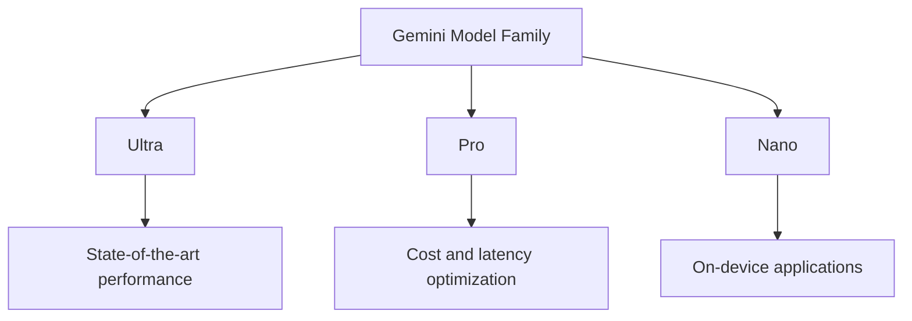

- **Gemini Model Family Overview**
  - **Sizes**: Ultra, Pro, Nano
    - **Ultra**: State-of-the-art performance, complex tasks, human-expert performance on MMLU (>90%).
    - **Pro**: Optimized for cost and latency, strong reasoning and multimodal capabilities.
    - **Nano**: On-device applications, 1.8B (Nano-1) and 3.25B (Nano-2) parameters, 4-bit quantized.

- **Performance Benchmarks**
  - Achieves state-of-the-art in 30 of 32 benchmarks.
  - Notable benchmarks:
    - MMLU: First model to achieve human-expert performance.
    - MMMU: New state-of-the-art score of 62.4%, >5 percentage points improvement.

- **Multimodal Capabilities**
  - Joint training across image, audio, video, and text.
  - Supports interleaved sequences of text, images, audio, and video.
  - Qualitative evaluation shows strong cross-modal reasoning.

- **Model Architecture**
  - Based on Transformer decoders with enhancements for stable training and optimized inference.
  - Supports 32k context length, efficient attention mechanisms (e.g., multi-query attention).

- **Training Infrastructure**
  - Utilizes TPUv5e and TPUv4 for training.
  - Large-scale training with TPUv4 in SuperPods (4096 chips).
  - High goodput (85% to 97%) achieved through in-memory model state copies.

- **Post-Training Variants**
  - **Gemini Apps**: Optimized for conversational AI (Gemini, Gemini Advanced).
  - **Gemini API**: Developer-focused, accessible via Google AI Studio and Cloud Vertex AI.

- **Applications and Use Cases**
  - Educational applications: Verifying student solutions, understanding complex reasoning.
  - Competitive programming: AlphaCode 2 ranks in top 15% on Codeforces.

- **Safety and Responsible Deployment**
  - Emphasis on impact assessments, model policies, and harm mitigation before deployment.

- **Key Innovations**
  - Addressing Silent Data Corruption (SDC) with deterministic replay and proactive scanning.
  - Rapid recovery from hardware failures using redundant in-memory copies.

- **Diagrammatic Note (if needed)**
