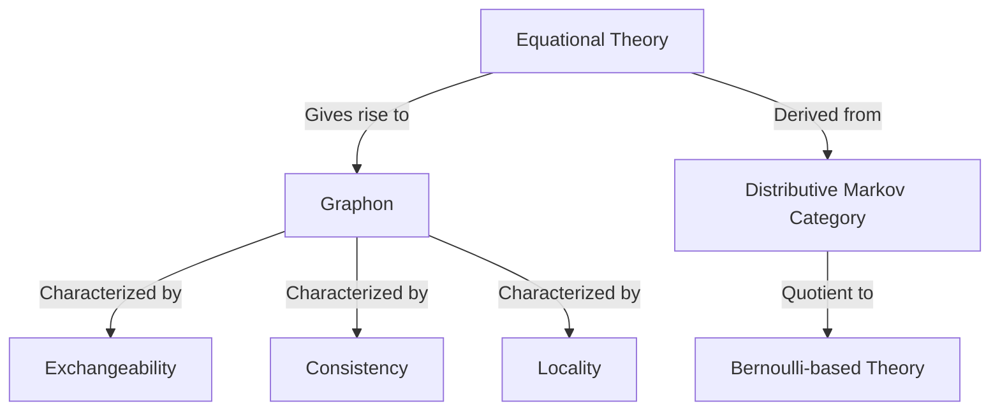

- **Key Concepts:**
  - **Probabilistic Programming:** Programming paradigm for statistical modeling, focusing on generative models.
  - **Graphons:** Symmetric measurable functions \( W: [0, 1]^2 \to [0, 1] \) that represent limits of sequences of finite graphs.
  - **Equational Theories:** Framework for analyzing implementations of probabilistic programming interfaces through equations rather than specific details.

- **Main Results:**
  - **Theorem 23:** Every well-behaved equational theory for the interface \((\text{vertex}, \text{new}, \text{edge})\) corresponds to a graphon.
  - **Corollary 26:** Every graphon arises from a good equational theory for the interface.

- **Interface Definitions:**
  - **Vertex Type:** Represents nodes in a graph.
  - **New Function:** \( \text{new}: \text{unit} \to \text{vertex} \) generates a new vertex.
  - **Edge Function:** \( \text{edge}: \text{vertex} \times \text{vertex} \to \text{bool} \) checks for edges between vertices.

- **Implementation Examples:**
  - **Geometric Random Graphs:** Vertices as points on a sphere; edges based on angular distance \( \theta \).
  - **Erdős-Rényi Graphs:** Each edge exists independently with fixed probability.

- **Equational Properties:**
  - **Bernoulli Base:** Closed programs of type \(\text{bool}\) equated with Bernoulli distributions.
  - **Symmetry and Determinism:** Edge relation is symmetric and deterministic.

- **Graphon Characterization:**
  - **Conditions for Graphons:**
    - **Exchangeability:** Permutation of vertices does not change distribution.
    - **Consistency:** Sequences of finite graphs converge to a graphon.
    - **Locality:** Local properties of graphs are preserved.

- **Categorical Framework:**
  - **Distributive Markov Categories:** Categorical structures that support the interface and probabilistic programming laws.
  - **Quotient Constructions:** Method to derive Bernoulli-based equational theories from abstract categories.

- **Concrete Models:**
  - **Measure-Theoretic Models:** For black-and-white graphons, using probability measures and Lebesgue integration.
  - **Rado-Nominal Sets:** For Erdős-Rényi graphons, introducing internal probability measures.

- **Practical Applications:**
  - **Generative Models:** Use of the graph interface in libraries like LazyPPL for statistical inference.
  - **Metropolis-Hastings Inference:** Example of inferring parameters from observed graph structures.

- **Diagrams (if needed):**

- **References:**
  - **Key Papers:** Include foundational works on probabilistic programming, graph theory, and categorical probability.