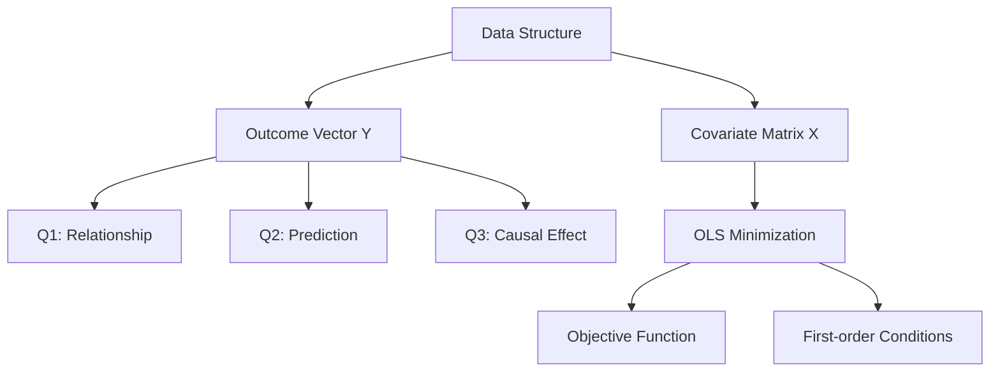

- **Linear Model Importance**: Serves as a foundational tool in statistics for making inferences and predictions about data-generating processes.
  
- **Key Questions Addressed**:
  - **Q1**: Relationship between covariates (X) and outcome (Y).
  - **Q2**: Predicting future outcomes (Y*) based on new data (X*).
  - **Q3**: Estimating causal effects of components in X on Y.

- **Data Structure**: 
  - Outcome vector: \( Y = \begin{pmatrix} y_1 \\ y_2 \\ \vdots \\ y_n \end{pmatrix} \)
  - Covariate matrix: \( X = \begin{pmatrix} x_{11} & x_{12} & \cdots & x_{1p} \\ x_{21} & x_{22} & \cdots & x_{2p} \\ \vdots & \vdots & \ddots & \vdots \\ x_{n1} & x_{n2} & \cdots & x_{np} \end{pmatrix} \)

- **Ordinary Least Squares (OLS)**:
  - Objective: Minimize the sum of squared residuals.
  - Criterion: \( (\alpha, \beta) = \arg \min_{a,b} \frac{1}{n} \sum_{i=1}^{n} (y_i - a - b x_i)^2 \)
  - First-order conditions for minimization:
    - \( -2 \sum_{i=1}^{n} (y_i - \alpha - \beta x_i) = 0 \)
    - \( -2 \sum_{i=1}^{n} x_i (y_i - \alpha - \beta x_i) = 0 \)

- **Statistical Properties of OLS**:
  - Assumes \( \text{cov}(\epsilon) = \sigma^2 I_n \) where \( \epsilon \) is the error term.
  - OLS provides unbiased estimates under the Gauss-Markov theorem when assumptions are met.

- **Key Acronyms**:
  - OLS: Ordinary Least Squares
  - ANOVA: Analysis of Variance
  - MLE: Maximum Likelihood Estimate
  - GEE: Generalized Estimating Equation

- **Useful R Packages**:
  - `car`: Eicker-Huber-White robust standard error
  - `MASS`: Ridge regression and negative-binomial regression
  - `glmnet`: Lasso with cross-validation

- **Linear Model Extensions**:
  - Can incorporate nonlinear terms to handle nonlinearity in data.
  - Examples include polynomial terms or transformations of covariates.

- **Causal Inference**: 
  - Emphasizes the challenge of estimating causal effects from observational data.
  - Randomized controlled trials (RCTs) are highlighted as the gold standard for causal inference.

- **Visualization**: 
  - Scatterplot of Galton's dataset illustrating the relationship between parental and child heights.
  
