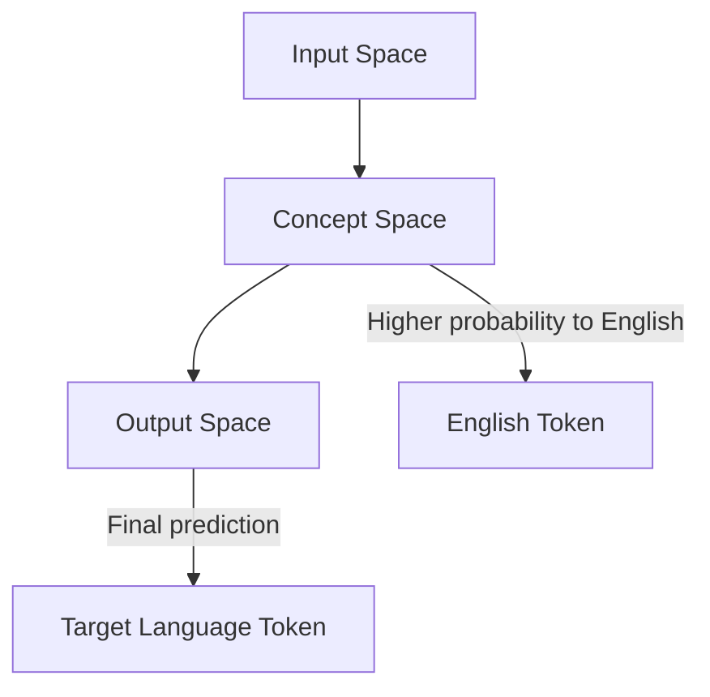

- **Research Question**: Investigate if multilingual language models (LLMs), specifically Llama-2, use English as an internal pivot language when processing non-English prompts.
  
- **Key Findings**:
  - **Three Phases of Embedding Transformation**:
    1. **Input Space**: Initial embeddings are far from output token embeddings.
    2. **Concept Space**: Middle layers allow for semantically correct next token decoding but favor English versions.
    3. **Output Space**: Final layers shift to input-language-specific embeddings.
  
- **Conceptual Model**: The three phases correspond to:
  - **Input Space**: Raw input embeddings.
  - **Concept Space**: Abstract representations that may be biased towards English.
  - **Output Space**: Final token predictions in the target language.

- **Mechanistic Interpretability**: Utilizes the logit lens technique to analyze intermediate embeddings and their transformations through layers.

- **Logit Lens Technique**: 
  - Applies the language modeling head prematurely to intermediate layers to decode next-token distributions.
  - Allows observation of token probabilities across layers, revealing a shift from English to the target language.

- **Llama-2 Model Details**:
  - **Architecture**: Autoregressive, decoder-only transformer with 7B, 13B, and 70B parameters.
  - **Training Data**: 89.70% English, with significant non-English data (e.g., 3.4B German tokens).
  - **Embedding Dimension**: 4096/5120/8192 depending on model size.

- **Implications of Findings**:
  - Suggests that LLMs may exhibit Anglocentric biases, affecting their performance and behavior in non-English contexts.
  - Raises questions about the nature of internal representations and their impact on multilingual capabilities.

- **Future Directions**: Further research needed on latent biases and their implications for trustworthy AI.

- **References for Further Reading**:
  - Touvron et al. (2023) on Llama-2.
  - Mechanistic interpretability techniques (Nanda et al., 2023; Meng et al., 2022).

- **Diagrammatic Note** (if needed):
