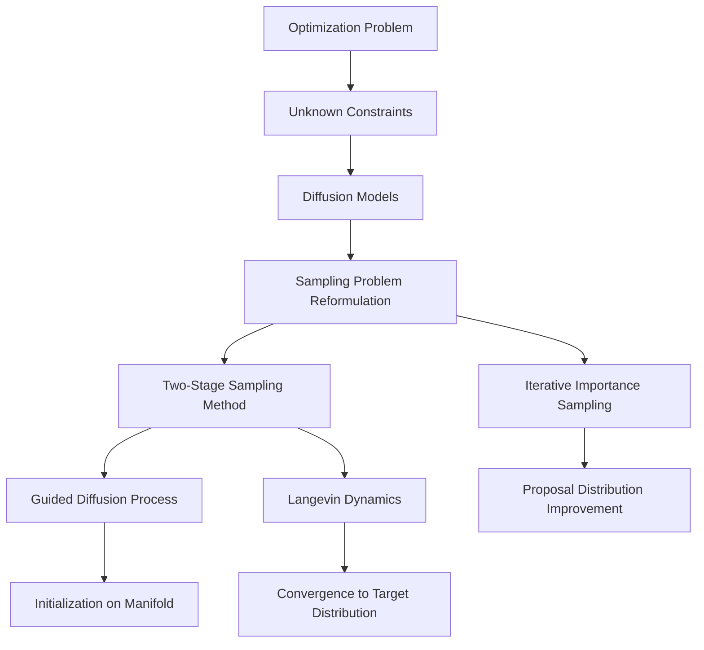

- **Problem Definition**: Optimization problem with objective function \( h: \mathbb{R}^d \to \mathbb{R} \) and feasible set \( C \subset \mathbb{R}^d \). Goal: Find minimizers \( \{x^*_i\}_{i=1}^M \) such that \( \{x^*_i\}_{i=1}^M = \arg \min_{x \in C} h(x) \).

- **Unknown Constraints**: Challenges arise when analytic constraints are unavailable, leading to potential spurious solutions. Importance of incorporating feasibility constraints in optimization.

- **Diffusion Models**: Utilized to learn the data distribution \( p \) concentrated on the feasible set \( C \). Forward noising process converges to a Gaussian distribution, while the reverse process generates data from noise.

- **Sampling Problem Reformulation**: Optimization is reformulated as sampling from the product of two densities:
  \[
  \pi_\beta(x) \propto p(x) q_\beta(x)
  \]
  where \( q_\beta(x) \propto \exp[-\beta h(x)] \).

- **Two-Stage Sampling Method** (for differentiable objectives):
  1. **Guided Diffusion Process**: Warm-up stage to initialize data samples on the manifold.
  2. **Langevin Dynamics**: Ensures convergence to the target distribution via Metropolis-Adjusted Langevin Algorithm (MALA).

- **Iterative Importance Sampling** (for non-differentiable objectives): Uses diffusion models as proposal distributions to improve sampling iteratively.

- **Key Proposition**: Under mild assumptions, the distribution \( Q_\infty \) converges to the minimizers of \( h \) as \( \beta \to \infty \):
  \[
  Q_\infty = \frac{\sum_{i=1}^M a_i \delta_{x^*_i}}{\sum_{i=1}^M a_i}
  \]

- **Product of Experts**: The target density is modeled as a product of independent models, ensuring that if any expert yields zero density, the total density is zero.

- **Empirical Validation**: Method (DIFFOPT) validated on synthetic datasets, six real-world black-box optimization tasks, and multi-objective molecule optimization, showing competitive performance against state-of-the-art methods.

- **Mermaid Diagram** (if needed for clarity):

- **Conclusion**: DIFFOPT effectively addresses optimization under unknown constraints by leveraging diffusion models for constrained sampling, demonstrating improved performance in various optimization tasks.