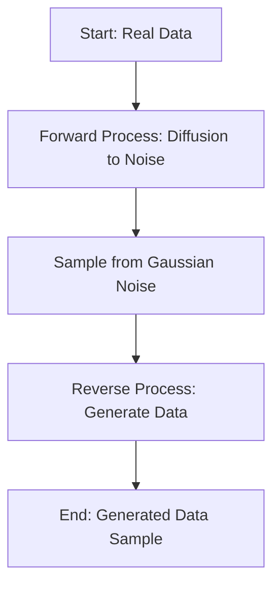

- **Generative Diffusion Models (GDMs)**: Utilize Langevin dynamics to transform data into Gaussian noise and back, facilitating unsupervised data generation.
  
- **Forward Process**: Described by the Ornstein-Ulhenbeck (OU) process:
  \[
  \dot{X} = -X + \sqrt{2}\xi
  \]
  where \(X \in \mathbb{R}^d\) and \(\xi\) is Gaussian white noise.

- **Solution to SDE**: The solution for the forward process is:
  \[
  X_t = e^{-t}X_0 + \sqrt{2}e^{-t}\int_0^t e^{s} \xi(s) ds
  \]

- **Probability Distribution**: For a Gaussian mixture model:
  \[
  p(X_0) = \frac{1}{2}N(\mu, I_d) + \frac{1}{2}N(-\mu, I_d)
  \]
  The distribution at time \(t\) is:
  \[
  p(X_t, t) = \frac{1}{2}N(X_t; \mu_t, I_d) + \frac{1}{2}N(X_t; -\mu_t, I_d)
  \]
  where \(\mu_t = \mu e^{-t}\).

- **Fluctuation Theorem**: Relates entropy production in forward and reverse processes, demonstrating that:
  \[
  \text{Entropy Production Rate} = \text{Forward Entropy} - \text{Reverse Entropy}
  \]

- **Entropy Changes**: Environmental and system entropy changes are computed, adhering to the fluctuation theorem.

- **Statistical Inference**: Generalized form includes a temperature-like parameter defined by a variance matrix, linking free energy to potential energy.

- **Franz-Parisi Potential**: Used to analyze hidden structures in conditional probabilities, particularly in the context of collapse transitions in reverse diffusion.

- **Phase Diagram**: Explores symmetry breaking, un-breaking, and unstable symmetry breaking phases in one-dimensional diffusion.

- **Path Probability**: For the forward process:
  \[
  P(X([T])|X_0) \propto e^{-\int_0^T L dt}
  \]
  where \(L\) is the Lagrangian defined as:
  \[
  L = \frac{1}{4}(\dot{X} + X)^2 - \lambda d
  \]

- **Reverse Dynamics**: The path probability for the backward trajectory is given by:
  \[
  P(X([T])|X_0) = N e^{-A(X([T]))}
  \]
  where \(A(X([T]))\) is the action for the reverse process.

- **Key Equations**:
  - Forward SDE: \(\dot{X} = -X + \sqrt{2}\xi\)
  - Reverse SDE: \(\dot{X}(s) = -\dot{X}(t)\)
  - Action for forward: \(A(X([T])) = \int_0^T \frac{1}{4}(\dot{X} + X)^2 dt\)

- **Diagrammatic Representation** (if needed):
