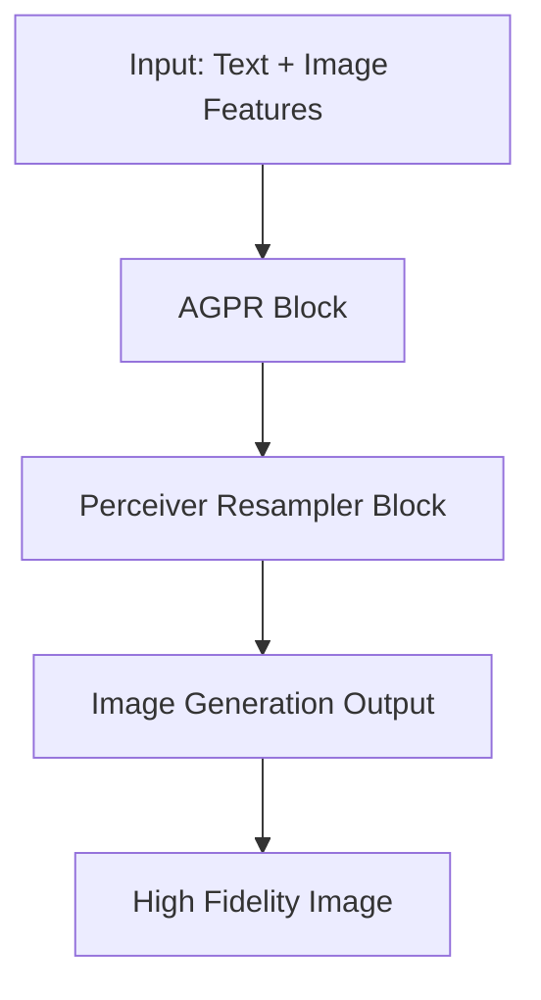

- **Model Overview**: EMMA is a multi-modal image generation model built on the ELLA text-to-image diffusion model, designed to effectively integrate multiple modalities (text and images) without compromising the control of text conditions.

- **Key Innovation**: Introduces the Assemblable Gated Perceiver Resampler (AGPR) which utilizes cross-attention to merge additional modalities into text features, allowing for flexible and context-aware image generation.

- **Parameter Freezing**: All parameters of the original ELLA model are frozen during training, ensuring that the text control remains intact while allowing for the adjustment of additional layers for multi-modal integration.

- **Multi-modal Feature Connector**: The AGPR blocks are interleaved with Perceiver Resampler blocks to facilitate the effective integration of multi-modal information during the image generation process.

- **Compatibility**: EMMA is designed to be a plug-and-play module compatible with existing diffusion models, particularly the Stable Diffusion framework, enabling diverse applications without the need for retraining.

- **Performance**: Extensive experiments demonstrate EMMA's ability to maintain high fidelity and detail in generated images, showcasing robustness against various control signals.

- **Applications**: EMMA can be used for personalized image generation, portrait generation, cartoon generation, and subject-driven video generation, highlighting its versatility across different domains.

- **Training Efficiency**: The modular assembly of models conditioned on different modalities allows for efficient training and adaptation to new tasks without the need for extensive retraining.

- **Attention Mechanism**: The model employs a special attention mechanism to balance the influence of different modalities during the image generation process, addressing the common issue of bias towards easier conditions.

- **Diagrammatic Representation**: 

- **Key Contributions**:
  1. Novel integration mechanism for multi-modal prompts.
  2. Modular and efficient model training.
  3. Universal compatibility and adaptability with existing models.
  4. Robust performance and detail preservation in generated images.