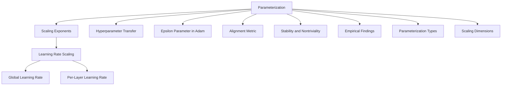

- **Key Concepts:**
  - **Parameterization:** A method for scaling quantities (initialization scale, parameter multipliers, learning rate) with respect to scaling dimensions (width, depth, batch size).
  - **Scaling Exponents:** Critical for ensuring stable training dynamics as model size increases; must be carefully selected to avoid scaling mismatches.

- **Learning Rate Scaling:**
  - **Global Learning Rate Limitation:** Constrains layers to use the same exponent, leading to potential instability (e.g., hidden layer O(1/√n) vs. readout layer O(1/n)).
  - **Per-Layer Learning Rate Prescription:** 
    - Standard Parameterization: 
      - Embedding Layer: O(1)
      - Hidden Layer: O(1/n)
      - Readout Layer: O(1/n)
    - Outperforms global learning rate approaches.

- **Hyperparameter Transfer:**
  - All parameterizations can achieve hyperparameter transfer, not just maximal update parameterization (muP).
  - Constant multiplicative factors can be tuned on small models and reused on larger models.

- **Epsilon Parameter in Adam:**
  - Importance of scaling epsilon correctly to avoid gradient underflow.
  - Introduction of **Adam-atan2:** A new version of Adam that eliminates the epsilon hyperparameter entirely, improving numerical stability.

- **Alignment Metric:**
  - Defines the correlation between parameters and data during training.
  - Affects scaling of activations; significant alignment leads to O(n) scaling, while no alignment leads to O(√n) scaling.

- **Theoretical Contributions:**
  - Generalized parameterization theory that quantifies distinct alignment contributions.
  - Recovery of prior work under specific alignment assumptions.

- **Stability and Nontriviality:**
  - Stability: Activations remain constant scale; logits do not exceed constant scale.
  - Nontriviality: Change in logits post-initialization must be at least constant scale.

- **Empirical Findings:**
  - Extensive experiments with various optimizers (SGD, Adam, Adafactor) and parameterizations show that existing theories may exclude effective parameterizations.
  - Best learning rate exponents often contradict prior alignment assumptions.

- **Parameterization Types:**
  - **Standard Parameterization:** Commonly used, with specific scaling behaviors.
  - **Neural Tangent Kernel (NTK) Parameterization:** Focuses on infinite-width limits.
  - **Maximal Update Parameterization (muP):** Emphasizes hyperparameter transfer.
  - **Mean-Field Parameterization (MFP):** Addresses scaling in a different regime.

- **Scaling Dimensions:**
  - Width, depth, context length, batch size, and training horizon are critical dimensions influencing parameterization.

- **Diagrammatic Note (if needed):**
