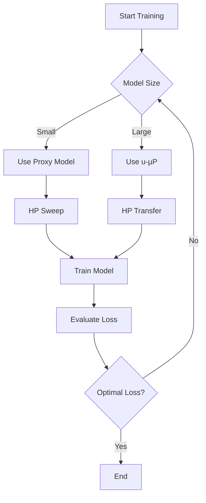

- **Objective of u-µP**: Combines Maximal Update Parametrization (µP) with Unit Scaling to create hyperparameters (HPs) that are independent of model size, facilitating efficient training and HP sweeps.

- **Key Contributions**:
  - Addresses drawbacks of µP, particularly in HP transfer and low-precision training.
  - Simplifies scaling rules by removing unnecessary HPs (base shape, initialization scale).
  - Enables out-of-the-box FP8 training with minimal degradation.
  - Provides a principled set of transferable HPs for consistent application across model sizes.

- **Stability Types**:
  1. **Feature Learning Stability**: Ensures balanced learning rates across model components.
  2. **Hyperparameter Stability**: Maintains optimal HPs as model size increases.
  3. **Numerical Stability**: Keeps floating-point representations within valid ranges during training.

- **HP Transfer**: 
  - µTransferable HPs are defined as those whose optimal values remain consistent across different model sizes.
  - Key multipliers: 
    - \( A_W \propto \alpha_W \)
    - \( B_W \propto \sigma_W \)
    - \( C_W \propto \eta_W \)

- **ABC-Symmetry**: 
  - Allows for scale shifts in HPs while preserving learning dynamics:
    - \( A_W \leftarrow A_W \cdot \theta \)
    - \( B_W \leftarrow B_W / \theta \)
    - \( C_W \leftarrow C_W / \theta \)

- **Independent HP Search**: 
  - u-µP allows for a more efficient search strategy, achieving near-optimal loss by sweeping only the learning rate (LR).

- **Low-Precision Training**: 
  - Emphasizes the importance of low-precision formats (e.g., FP8) for efficiency in large model training.
  - Unit Scaling ensures unit variance for activations, weights, and gradients, facilitating stable training in low-precision formats.

- **Unit Scaling**: 
  - Provides fixed scaling factors based on expected tensor statistics at initialization, ensuring unit variance and optimal starting points for training.

- **Training Dynamics**: 
  - u-µP models maintain effective training dynamics across varying model sizes, allowing for better performance and easier implementation.

- **Recommended HPs for u-µP**: 
  - A consistent and interpretable set of HPs is provided for effective model training, enhancing usability and performance.

- **Visual Representation** (if needed):
