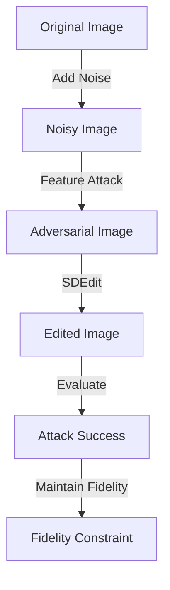

- **Title**: Pixel Is Not A Barrier: An Effective Evasion Attack for Pixel-Domain Diffusion Models
- **Key Focus**: Proposes a novel attacking framework for Pixel-domain Diffusion Models (PDMs) to counteract malicious image editing.
- **Main Contributions**:
  - Introduces a feature attacking loss to exploit vulnerabilities in denoising UNets.
  - Implements a latent optimization strategy using victim-model-agnostic VAEs to enhance adversarial image naturalness.
  - Achieves state-of-the-art performance against PDM-based editing methods (e.g., SDEdit).
- **Threat Model**: Targets SDEdit for unauthorized image manipulations, aiming to disrupt the reverse diffusion process.
- **Optimization Objective**: 
  - Formulated as: 
    \[
    \max_{x_{adv} \in M} d(SDEdit(x, t), SDEdit(x_{adv}, t)) \quad \text{subject to} \quad d'(x, x_{adv}) \leq \delta
    \]
  - Where \(M\) is the natural image manifold, \(d\) and \(d'\) are image distance functions, and \(\delta\) is the fidelity budget.
- **Methodology Overview**:
  - **Forward Process**: Introduces Gaussian noise to the clean image.
  - **Reverse Process**: Utilizes feature attacking loss to maximize feature distance between noisy latent representations.
- **Loss Functions**:
  - **Feature Attacking Loss**: Designed to distract UNet feature representation.
  - **Fidelity Loss**: Ensures imperceptibility of adversarial images and controls attack budget.
- **Experimental Results**: Demonstrates effectiveness and robustness against traditional defense methods, with transferability in black-box settings.
- **Related Works**:
  - Previous methods focused on Latent Diffusion Models (LDMs) and did not effectively address PDMs.
  - Notable works include PhotoGuard, AdvDM, and Mist, which primarily target LDMs.
- **Key Algorithms**:
  - **SDEdit**: A common method for diffusion-based image editing.
  - **Projected Gradient Descent (PGD)**: Used in previous attacks but costly for full diffusion process backpropagation.
- **Diagrammatic Note** (if needed):

- **Conclusion**: The proposed framework effectively addresses the gap in PDM vulnerability, providing a robust method for protecting images from malicious editing.