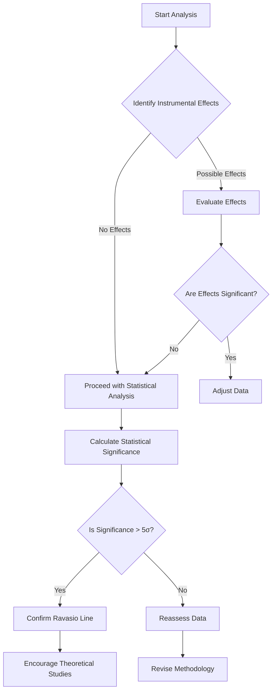

- **GRB 221009A Overview**: Brightest gamma-ray burst (BOAT) identified by Fermi-GBM, first observed on 2022 October 9 at T0 = 13:16:59.99 UTC.
  
- **Ravasio Line Characteristics**: Spectral line evolves from ∼12 MeV to 6 MeV over 80 seconds, first identified at ∼14 MeV starting at T0+280 s.

- **Statistical Significance**: The line's significance exceeds the 5σ discovery threshold, calculated using likelihood functions comparing continuum-only model (null hypothesis) to continuum+line model (alternative hypothesis).

- **Instrumental Effects Analysis**: 
  - No known instrumental artifacts can account for the observed spectral line behavior.
  - GBM data affected by two instrumental limitations: T0+219 s to T0+277 s and T0+508 s to T0+514 s.
  - Pulse pileup and afterglow effects ruled out as explanations for the line.

- **Statistical Methodology**: 
  - Likelihood ratio tests complicated by non-invertible detector responses; requires forward-folding of models.
  - AIC (Akaike Information Criterion) used to assess model preference, but requires verification due to boundary problems.

- **Empirical Determination of Significance**: 
  - Ravasio et al. (2024) find significant line presence in intervals 280-300 s and 300-320 s, with possible extensions into 320-340 s and 340-360 s.
  - Preference for Smoothly Broken Power Law (SBPL) continuum model in specific intervals.

- **Encouragement for Theoretical Studies**: The Fermi-GBM Team invites further theoretical exploration of the spectral feature unless alternative explanations are provided.

- **Key References**: 
  - Lesage et al. (2023) for initial GBM analysis.
  - Ravasio et al. (2024) for spectral line identification.
  - Statistical methods discussed in Algeri et al. (2019) and Gross & Vitells (2010).

- **Important Equations**: 
  - Likelihood Ratio: \( \Lambda = \frac{L(\text{alternative})}{L(\text{null})} \)
  - AIC: \( \text{AIC} = 2k - 2\ln(L) \) where \( k \) is the number of parameters and \( L \) is the likelihood.

- **Mermaid Diagram (if needed)**:

