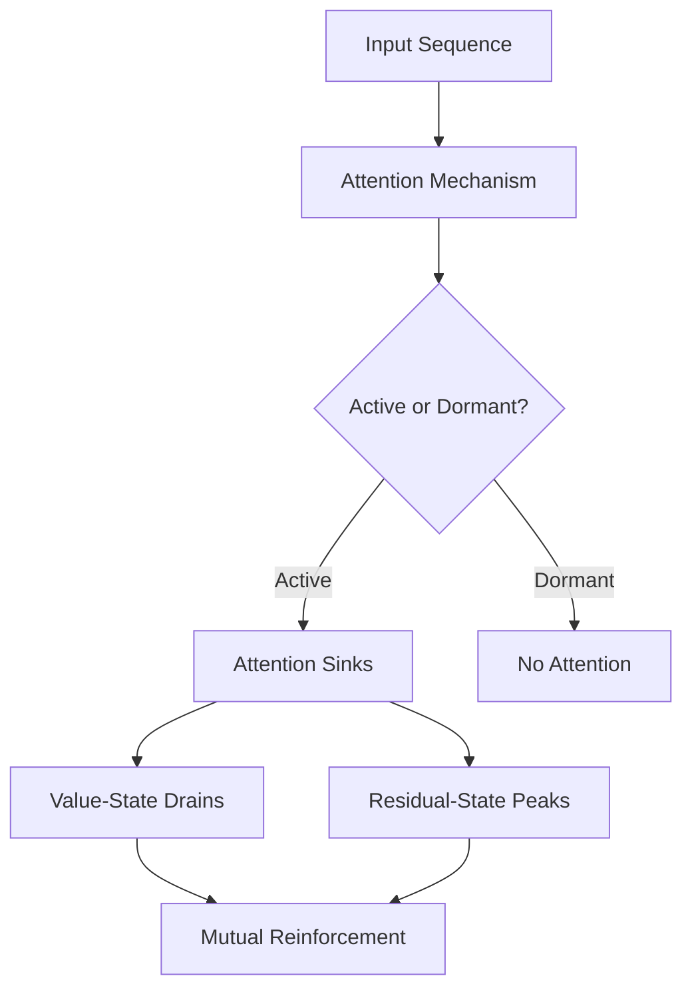

- **Extreme-Token Phenomena**: Refers to three observed phenomena in LLMs: attention sinks, value-state drains, and residual-state peaks.
  
- **Attention Sinks**: Specific tokens (sink tokens) receive disproportionately high attention weights, often the first token in a sequence.

- **Value-State Drains**: Sink tokens exhibit significantly smaller value states compared to other tokens.

- **Residual-State Peaks**: Sink tokens have larger residual-state norms than other tokens, particularly in layers excluding the first and last.

- **Active-Dormant Mechanism**: Attention heads can switch between active (sinks for specific inputs) and dormant states based on input domains.

- **Mutual Reinforcement Mechanism**: Attention sinks and value-state drains reinforce each other, leading to stable phases where query tokens generate similar attention logits for extreme tokens.

- **Bigram-Backcopy (BB) Task**: A simplified task used to demonstrate extreme-token phenomena; shows similar dynamics to those in pretrained LLMs.

- **Quantitative Properties**: Consistent observations include:
  - Logit concentration for extreme tokens: \( \Delta \text{logit}_{•,\langle s \rangle} = \text{logit}_{•,\langle s \rangle} - \text{Mean}[\text{logit}_{•,\text{others}}] \)
  - Value state norm: \( \| \text{Val}_{\langle s \rangle} \| \) shows monotonic decrease.
  - Residual state norm: \( \| \text{Res}_{\langle s \rangle} \| \) shows linear growth.

- **Architectural Modifications**: 
  - Replacing SoftMax with ReLU in attention heads mitigates extreme-token phenomena.
  - Switching from Adam to SGD removes residual-state peaks.

- **Empirical Evidence**: Observations from pretrained models like Llama and OLMo support the active-dormant and mutual reinforcement mechanisms.

- **Challenges in LLMs**: Extreme-token phenomena complicate inference, quantization, and interpretability, necessitating special treatment for sink tokens.

- **Diagrammatic Representation** (if needed):

- **Key Contributions**: 
  - Identification of mechanisms behind extreme-token phenomena.
  - Proposal of strategies to mitigate these phenomena during pretraining.
  - Demonstration of the relevance of findings from the BB task to real-world LLMs.