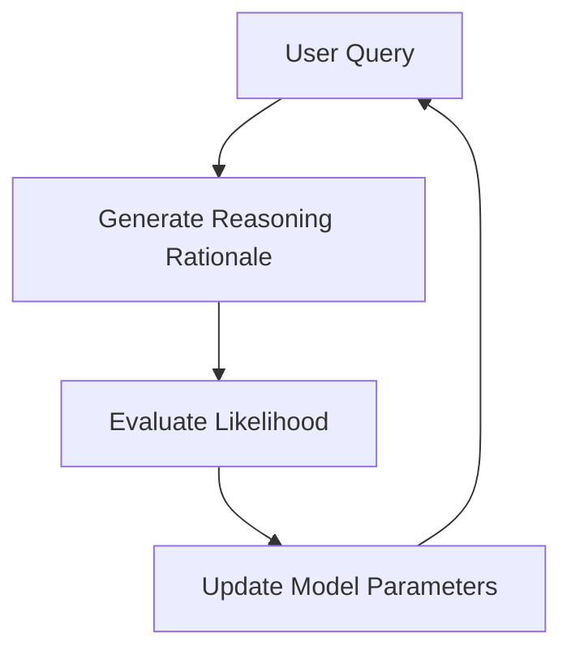

- **LaTent Reasoning Optimization (LaTRO)**: A framework that optimizes reasoning in LLMs by sampling from a latent distribution and using variational approaches.
  
- **Key Contributions of LaTRO**:
  - Theoretical formulation connecting LLM reasoning optimization to latent variable models.
  - Self-rewarding mechanism leveraging the model's own probability estimates.
  - Significant performance improvements on reasoning tasks (e.g., GSM8K) across various model architectures.

- **Performance Metrics**:
  - LaTRO improves zero-shot accuracy by an average of 12.5% over base models and 9.6% over supervised fine-tuning on GSM8K.

- **Reasoning Techniques**:
  - **Chain-of-Thought (CoT)**: Decomposes tasks into smaller reasoning steps.
  - **Self-Consistency Chain-of-Thought (CoT-SC)**: Uses majority voting over multiple reasoning rationales to enhance reasoning ability.

- **Self-Rewarding Mechanism**:
  - Evaluates the likelihood of generating correct answers based on observed reasoning paths, allowing LLMs to improve their reasoning capabilities without external feedback.

- **Variational Approach**:
  - Introduces a "reasoner" \( q(z | x) \) to sample latent reasoning rationales, optimizing the likelihood of generating correct answers:
  \[
  \max_{\theta} E_{(x, y) \sim D_{Gold}} \left[ \log \pi_{\theta}(y | x) \right]
  \]

- **Algorithm Overview**:
  - LaTRO iteratively generates reasoning rationales, evaluates their quality, and updates model parameters to favor high-quality rationales.

- **Empirical Validation**:
  - LaTRO's effectiveness demonstrated through experiments on GSM8K and ARC-Challenge datasets, showing enhanced reasoning capabilities in pre-trained LLMs.

- **Challenges in LLM Training**:
  - Scarcity of high-quality reasoning data limits traditional supervised fine-tuning.
  - Over-confidence and performance degradation due to lack of diversity in reasoning strategies.

- **Diagrammatic Representation** (if needed):

- **Code Availability**: LaTRO implementation can be accessed at [GitHub - SalesforceAIResearch/LaTRO](https://github.com/SalesforceAIResearch/LaTRO).