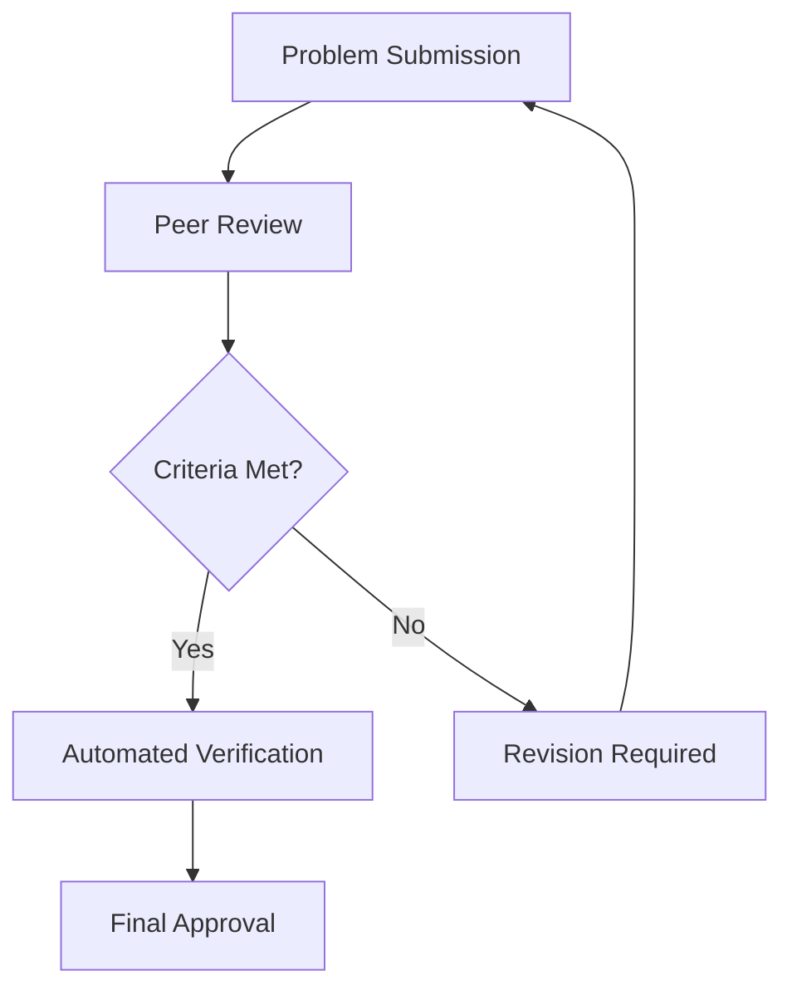

- **FrontierMath Overview**
  - A benchmark for evaluating advanced mathematical reasoning in AI.
  - Comprises hundreds of original, challenging mathematics problems vetted by expert mathematicians.
  - Covers major branches of modern mathematics: number theory, real analysis, algebraic geometry, category theory, etc.
  - Current AI models solve <2% of problems, indicating a significant gap in capabilities.

- **Key Features of FrontierMath**
  - **Originality**: Problems are novel and require genuine mathematical insight.
  - **Automated Verifiability**: Solutions can be automatically verified using SymPy.
  - **Guessproofness**: Problems designed to minimize guessing; <1% chance of guessing the correct answer.
  - **Computational Tractability**: Solutions must run in <1 minute on standard hardware.

- **Problem Creation Guidelines**
  - Problems must be original and not easily derived from existing problems.
  - Each problem includes a verification script and comprehensive metadata.
  - Peer-reviewed by mathematicians to ensure quality and correctness.

- **Automated Verification Process**
  - LLM submits code that computes the answer, saved as a Python object.
  - Verification script checks for correctness:
    - Exact match for unique integer solutions.
    - SymPy evaluation for unique symbolic answers.
    - Custom scripts for other cases.

- **Quality Assurance**
  - Multi-stage review process involving blind peer review.
  - Criteria include correctness, clarity, guessproofness, and appropriate difficulty ratings.

- **Sample Problems**
  - **Artin's Primitive Root Conjecture**: Involves definitions of \( v_p(n) \) and \( \text{ord}_p(a) \).
  - **Degree 19 Polynomial**: Construct a polynomial \( p(x) \in \mathbb{C}[x] \) with specific properties.

- **Comparison with Other Benchmarks**
  - FrontierMath maintains >98% unsolved rate, unlike saturated benchmarks like MATH and GSM-8K.

- **Expert Validation**
  - Interviews with prominent mathematicians confirm the exceptional difficulty and relevance of the problems.

- **Mathematical Domains Covered**
  - Includes algebraic geometry, number theory, topology, combinatorics, category theory, and more.

- **Figures and Diagrams**
  - **Figure 1**: Overview of problem types and difficulty.
  - **Figure 2**: Comparison of unsolved problems across benchmarks.
  
