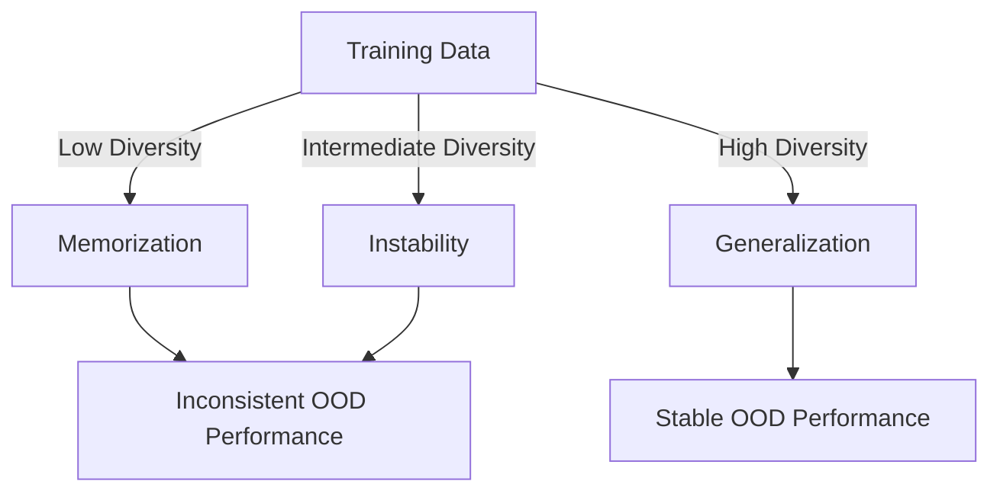

- **Key Concepts:**
  - Language models (LMs) often rely on surface-level heuristics early in training, resembling n-gram models.
  - Transition from surface-level heuristics to hierarchical syntactic representations is termed **structural grokking**.
  
- **Data Characteristics:**
  - **Data Diversity:** Variation in syntactic structure influences model behavior; low diversity leads to memorization, while high diversity promotes generalization.
  - **Data Complexity:** Complexity, measured by center-embedded sentences, induces hierarchical rules; simpler data leads to surface-level rules.

- **Generalization Behavior:**
  - Models exhibit stable OOD performance only when they consistently apply either a surface-level heuristic or a hierarchical rule.
  - Mixing complex and simple grammatical structures results in unstable training dynamics and inconsistent generalization across random seeds.

- **Training Dynamics:**
  - Intermediate levels of data diversity can lead to greater instability than low-diversity memorization or high-diversity generalization.
  - Competition between different generalization rules contributes to training instability and inconsistent outcomes.

- **Experimental Tasks:**
  - **Question Formation (QF) Task:** 
    - Two strategies: linear rule (first auxiliary verb) vs. hierarchical rule (based on syntax tree).
    - OOD accuracy measures hierarchical generalization.
  - **Tense Inflection (TI) Task:**
    - Requires identifying the subject for correct verb inflection.
    - Similar structure to QF task regarding ambiguous vs. unambiguous examples.

- **Model Architecture:**
  - Decoder-only Transformer with 8 heads, 512-dimensional embedding.
  - QF models: 6 layers; TI models: 4 layers.
  - Trained on a causal language modeling objective for 300K steps using Adam optimizer.

- **Important Findings:**
  - Data composition critically shapes OOD generalization behavior.
  - Models trained on less diverse data may stabilize in a memorization regime without learning systematic rules.

- **References for Further Reading:**
  - Murty et al. (2021) on structural grokking.
  - McCoy et al. (2019, 2020) on hierarchical generalization in neural networks.
  
- **Diagrammatic Note (if needed):**
