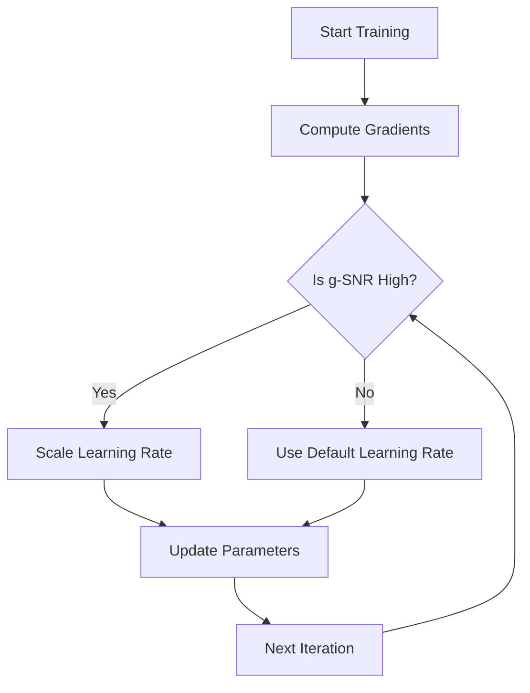

- **SGD-SaI Overview**: A novel optimization method that enhances SGD by applying Learning Rate Scaling at Initialization (SaI) based on gradient signal-to-noise ratios (g-SNR), eliminating the need for adaptive gradient methods.

- **g-SNR Definition**: Gradient signal-to-noise ratio (g-SNR) quantifies the relationship between the norm of a gradient and its variance, providing a measure to adjust learning rates effectively.

- **Memory Efficiency**: SGD-SaI reduces memory usage by approximately 50% compared to AdamW, achieving savings of 5.93 GB for GPT-2 (1.5B parameters) and 25.15 GB for Llama2-7B in full-precision training.

- **Performance Comparison**: SGD-SaI consistently matches or outperforms AdamW across various tasks, including ImageNet-1K classification with Vision Transformers (ViT) and GPT-2 pretraining for large language models (LLMs).

- **Key Contributions**:
  - Challenges the necessity of adaptive gradient methods.
  - Proposes a constant g-SNR value to replace second-order momentum, reducing memory and computation costs.
  - Empirical analysis of g-SNR characteristics during training and across parameters.

- **SGD Update Rule**: 
  \[
  \theta_{t+1} = \theta_t - \eta_t D_t
  \]
  where \(D_t = g_t\) for SGD, and \(g_t = \nabla L(\theta_t)\).

- **SGDM Update Rule**: 
  \[
  m_t = \beta_1 m_{t-1} + (1 - \beta_1) g_t
  \]
  \[
  D_t = m_t
  \]

- **Adam Update Rule**: 
  \[
  v_t = \beta_2 v_{t-1} + (1 - \beta_2) g_t^2
  \]
  \[
  D_t = \alpha_t m_t, \quad \alpha_t = \frac{1}{\sqrt{v_t} + \epsilon}
  \]

- **Empirical Findings**: SGD-SaI shows robustness to hyperparameter variations and performs well in diverse applications, including LoRA fine-tuning for LLMs and diffusion models.

- **Gradient Initialization Insights**: Early gradient patterns significantly correlate with model performance, influencing the design of effective training strategies.

- **Notation Summary**:
  - \( \theta \in \mathbb{R}^d \): Parameters of the neural network.
  - \( L(\theta) \): Loss function to minimize.
  - \( \eta > 0 \): Global learning rate.
  - \( \lambda \geq 0 \): Weight decay coefficient.
  - \( \mu \): Momentum coefficient.
  - \( g^{(i)}_t \): Gradient of the loss w.r.t. \( \theta^{(i)} \) at step \( t \).

- **Algorithm Flowchart** (if needed):
