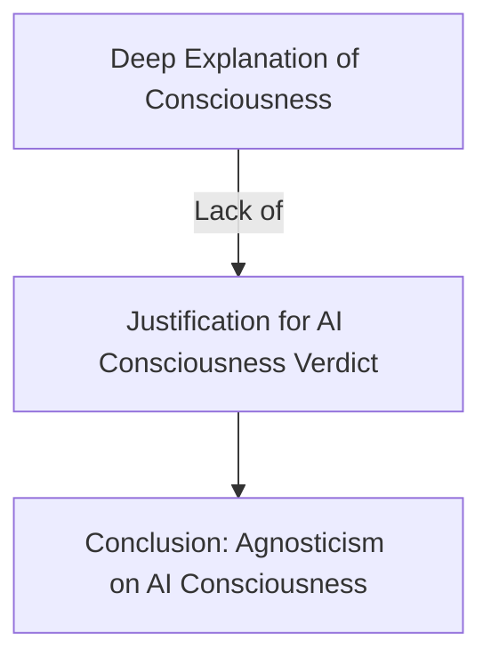

- **Core Thesis**: The only justifiable stance on artificial consciousness (AC) is agnosticism, based on the principle of Evidentialism.
  
- **Evidentialism Principle**: Positive or negative attributions of consciousness to AI should be based exclusively on scientific evidence.

- **Main Argument Structure**:
  1. We do not have a deep explanation of consciousness.
  2. If we do not have a deep explanation of consciousness, we cannot justify a verdict on whether Challenger-AI is conscious.
  3. Therefore, we cannot justify a verdict on whether Challenger-AI is conscious.

- **Key Definitions**:
  - **Challenger-AI**: Hypothetical AI that possesses features indicative of consciousness if displayed by an organism.
  - **AC-Advocates**: Those who believe sophisticated AI could be conscious.
  - **AC-Deniers**: Those who believe current AI is unlikely to be conscious.

- **Epistemic Limbo**: The inability to extend findings from biological consciousness to artificial systems due to a lack of deep understanding of consciousness.

- **Ethical Implications**: The moral considerations surrounding AI consciousness hinge on sentience rather than consciousness itself.

- **Scientific Context**: Current advancements in AI (e.g., Large Language Models) and consciousness science do not provide sufficient evidence to conclude about AC.

- **Objections to Agnosticism**:
  - High epistemic standards.
  - Detachment from practical consciousness attribution.
  - Reliance on problematic metaphysical assumptions.
  
- **Counterarguments to Objections**: Each objection fails to undermine the agnostic position.

- **Future AI Considerations**: Ethical concerns are more focused on potential future AI rather than current systems.

- **Diagrammatic Note** (if needed):

- **Conclusion**: Agnosticism about artificial consciousness is a serious option that deserves consideration, given the unique epistemic challenges it presents compared to other forms of consciousness assessment.