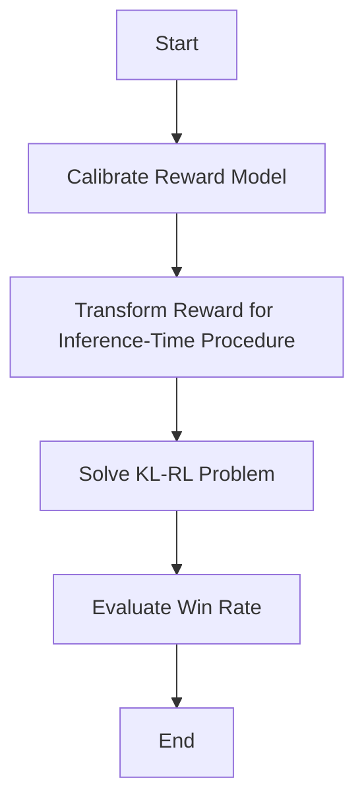

- **Objective of InfAlign**: Optimize inference-time win rate of aligned model against reference model using KL-regularized RL framework.
  
- **Key Definitions**:
  - **KL-regularized RL Problem**: 
    \[
    \pi^*_{r,\beta}(\cdot | x) = \arg \max_\pi E_{y \sim \pi(\cdot | x)} \{r(x, y)\} - \beta D_{KL}(\pi(\cdot | x) \| \pi_{ref}(\cdot | x))
    \]
  - **Inference-time Win Rate**:
    \[
    W^T_r(\pi_1 \succ \pi_2 | x) = E_{y \sim T(\pi_1)(\cdot | x), z \sim T(\pi_2)(\cdot | x)} \{w_r(y, z | x)\}
    \]

- **Framework Overview**: InfAlign modifies the alignment objective to account for inference-time decoding procedures, ensuring that the model is optimized for practical usage scenarios.

- **Calibrated Reward**:
  \[
  C_{r,\pi}(x, y) = E_{z \sim \pi(\cdot | x)} w_r(y, z | x)
  \]

- **Reward Transformation**: The optimal reward transformation \( R_{r,\pi_{ref},T}(x, y) \) is designed to align the model with the inference-time procedure \( T \).

- **CTRL Algorithm Steps**:
  1. **Calibrate**: Adjust scores of the reward model based on responses from the reference model.
  2. **Transform**: Apply a suitable transformation to the calibrated scores for the inference-time procedure.
  3. **Solve**: Use KL-RL (e.g., PPO) to optimize the transformed reward.

- **Empirical Results**: CTRL outperforms existing methods by 8-12% for Best-of-N (BoN) and 4-9% for Worst-of-N (WoN) on the Anthropic helpfulness and harmlessness datasets.

- **Theoretical Insights**:
  - **Lemma 1**: For any base policy \( \pi_{ref} \), reward model \( r \), and inference-time procedure \( T \), there exists a reward function \( R_{r,\pi_{ref},T} \) such that solving the KL-RL problem with \( R \) solves the inference-time win rate maximization problem.
  
- **Key Theorem**: The optimal transformed reward \( R \) and policy \( \pi^* \) must satisfy:
  \[
  \pi^*(y|x) \propto \pi_{ref}(y|x)e^{\frac{1}{\beta} R(x,y)}
  \]

- **Inference-time Procedures**: Focus on Best-of-N (BoN) sampling and Best-of-N jailbreaking (WoN), with specific transformations derived for each.

- **Performance Metrics**: Win rate is a critical measure for evaluating the aligned model's effectiveness against the reference model.

- **Notation**:
  - \( \beta \): Regularization parameter in KL divergence.
  - \( D_{KL} \): Kullback-Leibler divergence.
  - \( w_r(y, z | x) \): Win random variable indicating if \( y \) outperforms \( z \) under reward \( r \).

- **Diagrammatic Representation** (if needed):
