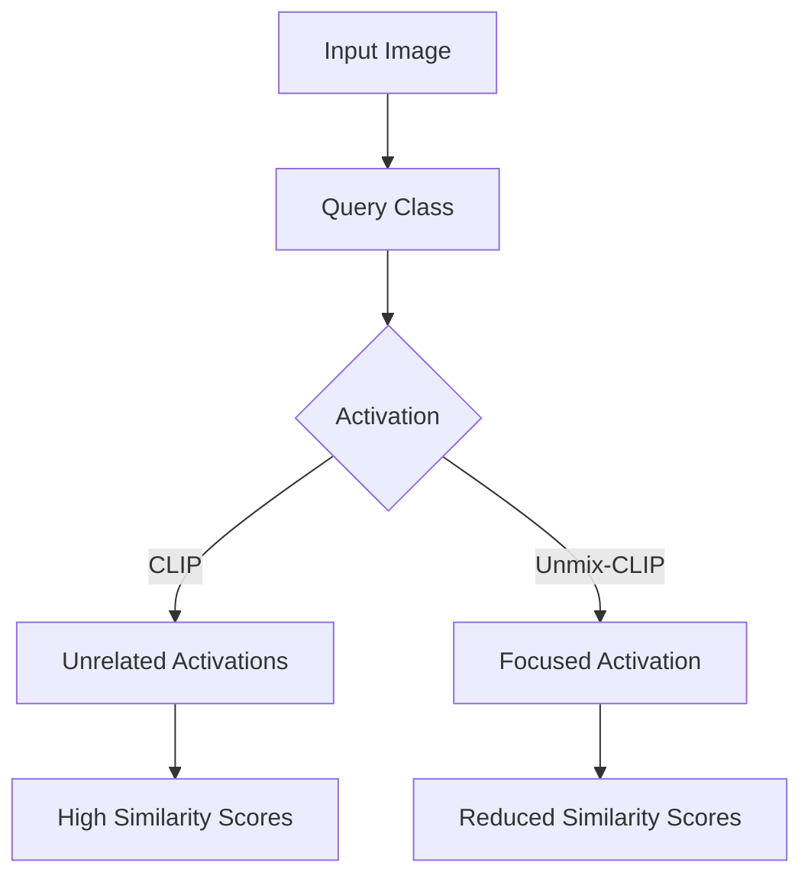

- **Key Issue Identified**: Vision-language models (VLMs) like CLIP struggle with fine-grained tasks due to high mutual feature information (MFI) among class features, leading to performance degradation in tasks requiring localized understanding.

- **Mutual Feature Information (MFI)**: MFI refers to the phenomenon where features of one class activate unrelated classes during queries, indicating entanglement in the feature space. Example: querying 'person' activates regions for 'dog' and 'horse' with high similarity scores (e.g., person-dog: 0.84).

- **Proposed Solution**: Unmix-CLIP framework designed to reduce MFI and improve feature disentanglement through:
  - **MFI Loss**: A loss function that minimizes inter-class similarity by projecting text features into a space where their self-similarity matrix approximates an identity matrix.
  - **Multi-Label Recognition (MLR)**: Aligns image features with the disentangled text features to ensure both modalities are effectively separated.

- **Architecture Changes**: 
  - Removal of CLIP's final spatial pooling layer to preserve localized information in feature maps.
  - Joint training of MFI loss and MLR loss to achieve disentangled features across image and text domains.

- **Performance Metrics**:
  - Unmix-CLIP reduces feature similarity by 24.9% on the COCO-14 dataset.
  - Outperforms state-of-the-art (SOTA) methods in multi-label recognition (MLR) and zero-shot semantic segmentation (ZS3) tasks, using fewer training parameters (one-third of SOTA).

- **Datasets Used**:
  - COCO-14 for MLR evaluation.
  - VOC2007 for comparative analysis.
  - VOC2012 and COCO-17 for zero-shot semantic segmentation tasks.

- **Experimental Results**: 
  - Competitive performance on VOC2007.
  - Significant improvements on COCO-14, demonstrating the effectiveness of reducing MFI for fine-grained tasks.

- **Visual Representation**: 
  - **Figure 1**: Comparison of activated regions when querying 'person' class, showing reduced activation of unrelated classes in Unmix-CLIP compared to CLIP.

- **Main Contributions**:
  - Identification of MFI as a critical challenge in adapting VLMs for fine-grained tasks.
  - Introduction of Unmix-CLIP to effectively reduce MFI and enhance task-specific utility.
  - Demonstration of improved performance in MLR and ZS3 tasks with fewer training parameters.