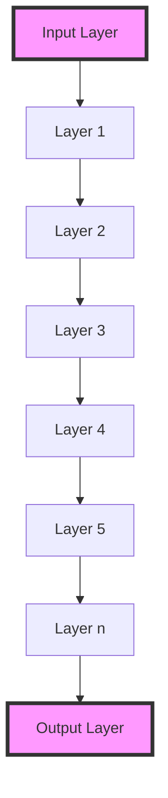

- **Curse of Depth (CoD)**: Phenomenon where deeper layers in LLMs contribute less to learning and representation than earlier layers, leading to resource inefficiency.
  
- **Root Cause**: Identified as Pre-Layer Normalization (Pre-LN), which causes output variance to grow exponentially with model depth, resulting in deep layers having derivatives close to the identity matrix.

- **LayerNorm Scaling**: Proposed solution that scales the output of Layer Normalization by \( \frac{1}{\sqrt{l}} \) (where \( l \) is the layer depth), effectively reducing output variance and enhancing the contribution of deeper layers during training.

- **Performance Drop Metric**: Defined as 
  \[
  \Delta P(\ell) = P(\ell)_{\text{pruned}} - P_{\text{original}}
  \]
  where \( P_{\text{original}} \) is the performance of the unpruned model and \( P(\ell)_{\text{pruned}} \) is the performance after removing layer \( \ell \).

- **Empirical Evidence**: Layer pruning experiments on models (e.g., LLaMA2, Mistral) show that deeper layers in Pre-LN models can be pruned with minimal performance degradation, while early layers are critical for performance.

- **Experimental Models**: Evaluated models include BERT-Large (Post-LN), Mistral-7B, LLaMA2-7B/13B, DeepSeek-7B, and Qwen-7B (all Pre-LN).

- **Key Findings**:
  - Pre-LN models exhibit diminishing effectiveness in deeper layers.
  - BERT-Large shows significant performance drop when pruning deeper layers, while Pre-LN models do not.

- **Training Dynamics**: The output variance of Pre-LN accumulates with depth, leading to ineffective transformations in deeper layers.

- **Implementation**: LayerNorm Scaling is simple to implement, requires no hyperparameter tuning, and introduces no additional parameters.

- **Performance Improvement**: Models pre-trained with LayerNorm Scaling show better performance on downstream tasks due to more effective deep layer contributions.

- **Diagrammatic Note**: 

- **Conclusion**: Addressing the Curse of Depth is essential for maximizing the utility of computational resources in training large models.