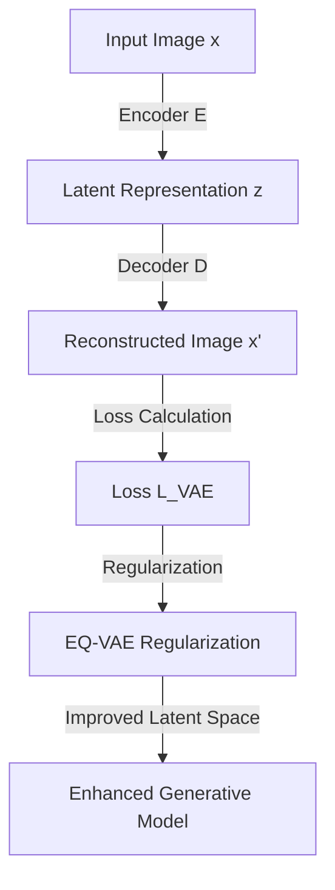

- **EQ-VAE Overview**: A regularization method that enforces equivariance in the latent space of autoencoders, improving generative performance without degrading reconstruction quality.

- **Key Contributions**:
  - Identifies lack of equivariance in existing autoencoders under spatial transformations (scaling, rotation).
  - Proposes EQ-VAE to penalize discrepancies between transformed latent representations and corresponding transformations of input images.
  - Compatible with both continuous (e.g., SD-VAE) and discrete (e.g., VQ-GAN) autoencoders.

- **Training Objective**:
  - The training objective for the autoencoder is defined as:
    \[
    L_{VAE}(x) = L_{rec}(x, x) + \lambda_{gan} L_{gan}(x) + \lambda_{reg} L_{reg}
    \]
  - Where:
    - \(L_{rec}\): Pixel space reconstruction objective.
    - \(L_{gan}\): Adversarial loss (patch-based).
    - \(L_{reg}\): Regularization term introduced by EQ-VAE.

- **Performance Improvement**:
  - Fine-tuning with EQ-VAE leads to significant speedups: 
    - \( \times 7 \) speedup on DiT-XL/2 with 5 epochs of SD-VAE fine-tuning.
    - \( \times 4 \) speedup on REPA with SiT-XL/2.

- **Equivariance vs. Invariance**:
  - EQ-VAE promotes equivariance (output changes in a predictable way with input transformations) rather than invariance (output remains unchanged).
  
- **Impact on Generative Models**:
  - Enhances performance of state-of-the-art generative models (DiT, SiT, REPA, MaskGIT) by improving the quality of the latent space.

- **Latent Space Characteristics**:
  - The latent space retains essential semantic and structural information while discarding high-frequency details.
  - The complexity of the latent space is reduced, facilitating better learning for generative models.

- **Empirical Evidence**:
  - Quantitative results demonstrate improved FID scores when applying EQ-VAE to both continuous and discrete autoencoders.

- **Diagrammatic Representation** (if needed):

- **References**:
  - Rombach et al. (2022) for latent diffusion models.
  - Kingma & Welling (2014) for variational autoencoders.
  - Relevant works on generative models and regularization strategies.