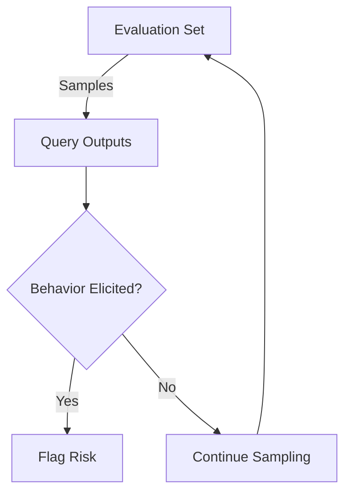

- **Problem Statement**: Standard evaluations fail to predict deployment risks due to scale disparity; evaluations use hundreds/thousands of queries while deployments handle billions.

- **Elicitation Probability**: Defined as the probability that a query elicits a target behavior. Formally:
  \[
  p_{\text{ELICIT}}(x; D_{\text{LLM}}, B) = E_{o \sim D_{\text{LLM}}(x)}[1[B(o) = 1]]
  \]

- **Scaling Law**: The logarithm of the largest elicitation probabilities follows a power-law with respect to the number of samples:
  \[
  Q_p(n) \text{ grows predictably with } n
  \]

- **Forecasting Method**: Use a small evaluation set to predict risks at deployment scale. For example, predict risks for 100,000 queries using data from 1,000 queries.

- **Key Metrics**:
  1. **Worst-Query Risk**: Maximum elicitation probability from n queries:
     \[
     \max_{i \in [n]} p_{\text{ELICIT}}(x_i; D_{\text{LLM}}, B)
     \]
  2. **Behavior Frequency**: Fraction of queries with elicitation probability above a threshold \( \tau \):
     \[
     E_{x \sim D_x}[1[p_{\text{ELICIT}}(x_i; D_{\text{LLM}}, B) > \tau]]
     \]
  3. **Aggregate Risk**: Probability that at least one output from n queries exhibits the behavior:
     \[
     1 - \prod_{i=1}^{n}(1 - p_{\text{ELICIT}}(x_i; D_{\text{LLM}}, B))
     \]

- **Empirical Findings**: Forecasts remain within one order of magnitude of true risk for 86% of misuse forecasts when scaling from 900 to 90,000 samples.

- **Practical Implications**: Enables proactive risk management by anticipating rare failures before deployment.

- **Limitations**: Forecasts can be sensitive to evaluation set specifics; deployment risks are inherently stochastic.

- **Related Work**: Builds on previous research in rare behavior detection and inference-time scaling laws, particularly in LLM safety.

- **Visual Representation**: 

- **Conclusion**: The method provides a framework for anticipating and mitigating risks associated with large-scale language model deployments, enhancing safety and reliability.