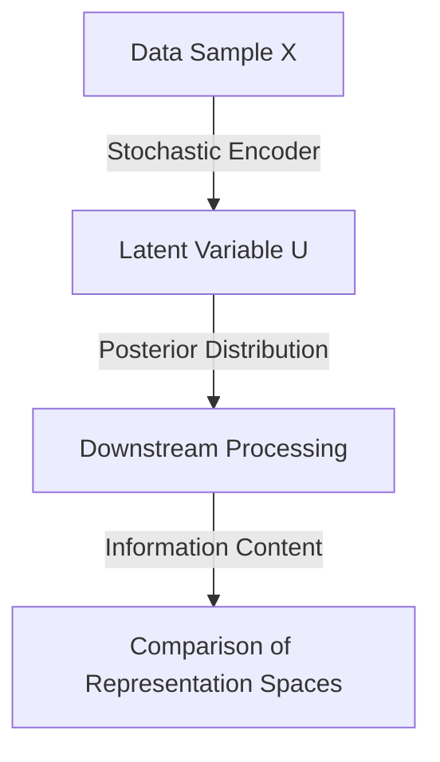

- **Probabilistic Representation Spaces**: Convey information shaped by training data, network architecture, and loss function; crucial for understanding learning processes.
  
- **Information-Theoretic Measures**: Two proposed measures extend classic methods for comparing information content of hard clustering assignments to probabilistic representation spaces.

- **Soft Clustering**: Treat probabilistic representation spaces as soft clustering assignments, where partial distinguishability is expressed through overlaps in posterior distributions.

- **Key Quantities**:
  - **Entropy**: \( H(Z) = E_{z \sim p(z)}[-\log p(z)] \)
  - **Mutual Information**: \( I(Y; Z) = H(Y) + H(Z) - H(Y, Z) \)

- **Applications**:
  - **Unsupervised Disentanglement**: Identifying information fragments in latent dimensions of VAE and InfoGAN ensembles.
  - **Model Comparison**: Consistent information content across datasets and methods, despite training variability.
  - **Model Fusion**: Leverage differentiability of measures for synthesizing information from weak learners.

- **Comparison of Clustering Assignments**: 
  - **Normalized Mutual Information (NMI)**: A measure for comparing clustering assignments.
  - **Variation of Information (VI)**: A metric distance between information sources.

- **Fuzzy Clustering**: Membership assigned to multiple clusters, summing to one for each datum; relevant for probabilistic representation spaces.

- **Challenges in Disentanglement**: Evaluation without ground truth; consensus among models as a proxy for disentanglement quality.

- **Methodology**: 
  - Focus on variational autoencoders (VAEs) for probabilistic embeddings.
  - Encoder maps data points to posterior distributions in latent space, facilitating information measurement.

- **Diagrammatic Representation** (if needed):
