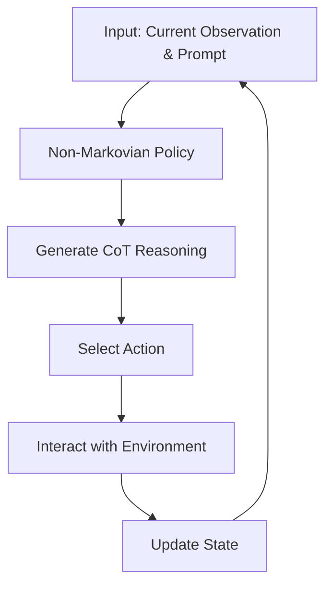

- **GFlowVLM Overview**: A framework that fine-tunes Vision-Language Models (VLMs) using Generative Flow Networks (GFlowNets) to enhance multi-step reasoning and promote diverse solution generation.

- **Key Limitations of Existing Methods**:
  - **Supervised Fine-Tuning (SFT)**: Assumes IID data, limiting generalization and solution diversity.
  - **Reinforcement Learning (RL) with PPO**: Focuses on maximizing cumulative rewards, often neglecting long-term dependencies.

- **Generative Flow Networks (GFlowNets)**:
  - Trains stochastic policies to sample diverse, high-reward sequences.
  - Models the environment as a non-Markovian decision process, capturing long-term dependencies.
  - Probability of sampling a terminal state \( x \) is proportional to the reward function \( R(x) \).

- **Mathematical Formulation**:
  - Trajectory flow \( F: T \to \mathbb{R}^+ \) defined over trajectories \( \tau \).
  - Forward policy \( P_F(\tau) = P_F(s_0 \to \ldots \to s_n) = \prod_{t=0}^{n-1} P_F(s_{t+1}|s_t) \).
  - Backward policy \( P_B(\tau) = P_B(s_n \to \ldots \to s_0) = \prod_{t=0}^{n-1} P_B(s_t|s_{t+1}) \).

- **Non-Markovian Approach**: 
  - Incorporates historical actions and states to inform current decision-making, essential for complex reasoning tasks.

- **Empirical Results**:
  - GFlowVLM outperforms SFT and PPO in tasks like card games and embodied planning, achieving higher success rates and solution diversity.
  - Example: In a numerical sequence prediction task, GFlowVLM achieved a 76.4% success rate, outperforming PPO by 26%.

- **Prompt Design**:
  - Inputs include current observation \( o_t \), task-specific prompt \( p_t \) (which contains goal description, history of actions, and states).
  - Outputs include Chain-of-Thought (CoT) reasoning \( c_t \) and action \( a_t \).

- **Training Efficiency**:
  - GFlowNets leverage off-policy training data, improving sample efficiency and accelerating convergence compared to on-policy methods.

- **Contributions**:
  - First integration of GFlowNets with VLMs for multi-step decision-making.
  - Enhanced exploration of reasoning paths and stronger generalization to out-of-distribution tasks.

- **Diagrammatic Representation** (if needed):

- **Future Directions**: Explore further applications of GFlowNets in other multimodal tasks and refine the framework for improved reasoning capabilities.